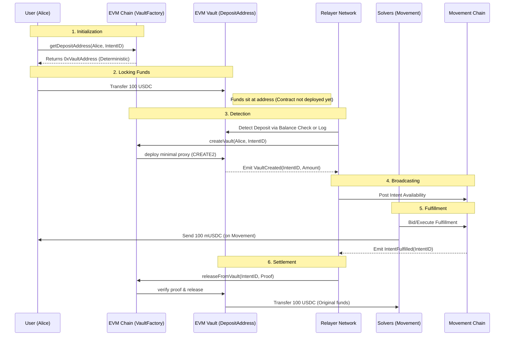

# EVM to Movement Intent Flow

This document illustrates the complete lifecycle of a cross-chain intent from an EVM chain (e.g., Ethereum, Arbitrum) to the Movement Network.

## 🔄 High-Level Flow



## 📝 Step-by-Step Walkthrough

### Scenario: Alice bridges 100 USDC from Ethereum to Movement

**Step 1: Intent Generation**
Alice wants to move 100 USDC to Movement. The frontend generates a unique `intent_id`.
- **Intent ID**: `0x123...abc`
- **Amount**: 100 USDC
- **Source**: Ethereum
- **Destination**: Movement

**Step 2: Deposit Address Derivation**
The frontend calls `IntentVaultFactory.getDepositAddress(Alice, intent_id)` on Ethereum.
- **Result**: `0xVaultAddress` (e.g., `0x789...xyz`)
- *Note: This is a view function, costs 0 gas.*

**Step 3: User Deposit (Lock)**
Alice sends 100 USDC to `0xVaultAddress` using a standard ERC20 transfer.
- **Tx**: `USDC.transfer(0x789...xyz, 100000000)`
- *Benefit: Alice doesn't need to interact with complex contracts, just a simple transfer.*

**Step 4: Vault Creation (Relayer)**
Relayers monitor the `0xVaultAddress`. When they see funds, they call `createVault` on the Factory.
- **Tx**: `Factory.createVault(Alice, intent_id)`
- **Effect**: The `DepositVault` contract is deployed to `0xVaultAddress`.
- **Event**: `VaultCreated(intent_id, 0xVaultAddress, Alice)`

**Step 5: Fulfillment (Movement)**
Solvers on Movement see the `VaultCreated` event on Ethereum.
- **Solver Bob** decides to fulfill the request.
- **Tx**: `Movement.fulfill_intent(intent_id, Alice, 100 mUSDC)`
- **Effect**: Alice receives her funds on Movement immediately (minus fees).

**Step 6: Settlement (Unlock)**
The protocol on Movement emits `IntentFulfilled`. Relayers pick this up.
- **Relayers** sign a message authorizing the release of the locked USDC on Ethereum to Bob (the Solver).
- **Tx**: `Factory.releaseFromVault(intent_id, USDC, Bob, Signatures)`
- **Effect**: The 100 USDC locked in `0xVaultAddress` is sent to Bob.

## 🛡️ Security Mechanisms

1.  **Fund Isolation**: Even if the Factory is hacked, Alice's funds are in a separate `0xVaultAddress`.
2.  **Expiry Refund**: If no Solver fulfills the request within 24 hours, Alice can call `refund()` on the Vault to get her USDC back.
3.  **Threshold Signatures**: Releasing funds requires signatures from a supermajority of Relayers (e.g., 2 out of 3).

## 💻 Concrete Data Example

| Parameter | Value |
| :--- | :--- |
| **User (Alice)** | `0xA11cE...` |
| **Solver (Bob)** | `0xB0B...` |
| **Intent ID** | `0x5d9b...` (Keccak hash of params) |
| **Token** | USDC (`0xA0b8...`) |
| **Amount** | 100,000,000 (100 USDC) |
| **Vault Address** | `0xVault...` (Derived via CREATE2) |
| **Nonce** | 1 (Prevents replay attacks) |

```json
// Relayer Proof Data (Signed by Relayers)
{
  "domain": {
    "name": "IntentVaultFactory",
    "version": "1",
    "chainId": 1,
    "verifyingContract": "0xFactory..."
  },
  "message": {
    "intentId": "0x5d9b...",
    "token": "0xA0b8...",
    "recipient": "0xB0B...", // Solver Bob's Address
    "nonce": 1
  }
}
```
