# Intent Protocol - User Flows & Real-World Examples

**A Simple Guide to Cross-Chain Bridging with Intent Protocol**

---

## 🎯 What is Intent Protocol?

Intent Protocol lets you **instantly** move tokens from Ethereum (or other chains) to Movement **without waiting for slow bridges**.

**The Magic**: Instead of waiting 15+ minutes for a traditional bridge, you get your tokens in seconds! A resolver provides liquidity immediately, and they get reimbursed later.

---

## 👥 The Players

| Role | Description | Example |
|------|-------------|---------|
| **User (Alice)** | Wants to move tokens cross-chain fast | Has 1000 USDC on Ethereum → Wants USDC on Movement |
| **Resolver (Bob)** | Provides instant liquidity, earns fees | Has liquidity on Movement, monitors for intents |
| **LP (Carol)** | Provides capital to liquidity pool, earns passive income | Deposits 100,000 USDC into pool |
| **Protocol** | Coordinates everything, takes small fee | Movement-based smart contracts |

---

## 📖 Real-World User Flows

### Flow #1: Alice Bridges USDC from Ethereum to Movement

**The Setup**:
- Alice has **1000 USDC** on Ethereum
- Alice wants to use a Movement DeFi app but needs USDC there
- Traditional bridge would take 15-20 minutes ⏰
- Intent Protocol delivers in **seconds** ⚡

#### Step-by-Step Flow


#### The Numbers

| Item | Amount | Notes |
|------|--------|-------|
| Alice locks on Ethereum | 1000 USDC | Source amount |
| Total fee (0.3%) | 3 USDC | Transparent pricing |
| Alice receives on Movement | **997 USDC** | Target amount |
| Bob earns (80% of fee) | 2.4 USDC | Resolver reward |
| Protocol earns (20% of fee) | 0.6 USDC | Sustainability |

**Timeline**:
- ⏱️ **Traditional Bridge**: 15-20 minutes
- ⚡ **Intent Protocol**: 10-30 seconds

---

### Flow #2: Multiple Users + Resolver Round-Robin

**The Setup**:
- 3 Active Resolvers: Bob, Charlie, Diana
- 3 Users want to bridge simultaneously
- System fairly distributes work

#### Scenario

```
Time: 14:30:00 - Alice creates intent #100 → Assigned to Bob
Time: 14:30:05 - Eve creates intent #101 → Assigned to Charlie  
Time: 14:30:10 - Frank creates intent #102 → Assigned to Diana
Time: 14:30:15 - Grace creates intent #103 → Back to Bob (round-robin!)
```

#### Why Round-Robin?

✅ **Fair Distribution**: Every resolver gets equal opportunities  
✅ **No Competition**: Resolvers don't race to fulfill (prevents gas wars)  
✅ **Predictable Income**: Resolvers can forecast earnings  
✅ **System Stability**: Prevents single resolver dominance

---

### Flow #3: Carol Becomes an LP (Liquidity Provider)

**The Setup**:
- Carol has **50,000 USDC** idle
- Wants passive income from fees
- No need to actively monitor or fulfill intents

#### Carol's Journey


#### LP Economics

**Deposit**:
```
Carol deposits: 50,000 USDC
Current pool size: 200,000 USDC
Current total shares: 200,000
Carol receives: (50,000 * 200,000) / 200,000 = 50,000 shares
```

**After 1 Month** (example):
```
Total intents fulfilled: 5,000
Average intent size: 500 USDC
Total fees collected: 5,000 * 1.5 = 7,500 USDC (0.3% avg)
Protocol share (20%): 1,500 USDC → goes to treasury
Pool's share (implicit): 7,500 USDC total volume growth

Carol's share value: Now worth more due to accumulated fees!
```

**Withdrawal**:
```
Carol withdraws: 50,000 shares
Pool value: 257,500 USDC
Total shares: 250,000
Carol receives: (50,000 * 257,500) / 250,000 = 51,500 USDC

Profit: 1,500 USDC (3% return in 1 month)
```

---

### Flow #4: Failed Intent (User Protection)

**The Setup**:
- Alice creates an intent
- Resolver Bob goes offline
- Intent expires after 1 hour
- Alice can reclaim on source chain

#### Expiry Flow

```mermaid
sequenceDiagram
    participant Alice as 👩 Alice
    participant Intent as 🎯 Intent Registry
    participant Bob as 👨 Bob (Offline ❌)
    participant Time as ⏰ Time
    
    Alice->>Intent: Create Intent<br/>Expiry: 1 hour
    Intent->>Bob: Assigned to Bob
    Bob->>Bob: ❌ Offline (no response)
    
    Time->>Time: ⏰ 1 hour passes...
    
    Alice->>Intent: mark_expired(intent_id)
    Intent-->>Alice: ✅ Intent marked expired
    
    Note over Alice: Now can reclaim 1000 USDC<br/>from Ethereum lock contract
    
    Alice->>Alice: Uses Ethereum contract to<br/>withdraw original 1000 USDC
```



**User Protection**:
- ✅ Intent expires if not fulfilled in time
- ✅ User can reclaim locked funds on source chain
- ✅ No loss of funds
- ⚠️ Lost some time, but money is safe

---

### Flow #5: Bob the Resolver's Daily Operations

**Bob's Setup**:
- Stake: 10,000 USDC (requirement to be a resolver)
- Available Liquidity: 100,000 USDC across pools
- Monitors Movement testnet for new intents

#### Bob's Typical Day

**Morning (9 AM)**:
```
✅ Registered as resolver
✅ 10,000 USDC staked
✅ Monitoring service running
✅ Connection to Ethereum node active
```

**9:15 AM - First Intent**:
```
🔔 New Intent #150
   Source: 2000 USDC @ Ethereum
   Target: 1994 USDC @ Movement
   Fee: 6 USDC (Bob gets 4.8 USDC)
   TX Hash: 0x7f8...

🔍 Bob's Verification:
   1. Check Ethereum: Did user lock 2000 USDC? ✅
   2. Check TX confirmations: 12 blocks ✅
   3. Check intent details: All valid ✅

✅ Bob fulfills → Earns 4.8 USDC (30 seconds work)
```

**Throughout the Day**:
```
Intent #151: +3.2 USDC
Intent #152: +2.4 USDC
Intent #153: +5.6 USDC
Intent #154: +1.8 USDC
...
Intent #175: +4.2 USDC

Total: 25 intents fulfilled
Earnings: 94.5 USDC
Time spent: ~12.5 minutes
Hourly rate: $453 equivalent! 💰
```

**Why Resolvers Love This**:
- 💰 **Predictable fees**: 80% of all fees from assigned intents
- 🤖 **Automated**: Bot handles verifications  
- 📈 **Scalable**: More intents = more earnings
- ⚡ **Fast**: Earn fees in seconds per intent

---

## 🌍 Supported Chains & Assets

### Current Support (Testnet)

| Chain | Chain ID | Assets | Status |
|-------|----------|--------|--------|
| **Ethereum Mainnet** | 1 | Any ERC-20 | ✅ Supported |
| **Ethereum Sepolia** | 11155111 | Test tokens | ✅ Supported |
| **Movement Porto** | - | MOVE, AptosCoin | ✅ Native |

### Coming Soon

| Chain | Chain ID | Popularity | ETA |
|-------|----------|------------|-----|
| **BSC** | 56 | High | Q1 2025 |
| **Polygon** | 137 | High | Q1 2025 |
| **Arbitrum** | 42161 | Medium | Q2 2025 |
| **Optimism** | 10 | Medium | Q2 2025 |

---

## 💡 Common Use Cases

### 1. DeFi User Moving to Movement

**Scenario**: Sarah has 5000 USDC on Ethereum and wants to use Movement's new DEX.

**Traditional Way**:
1. Approve bridge contract (1 tx, 2 min)
2. Initiate bridge (1 tx, 2 min)
3. Wait for confirmations (15-20 min)
4. Claim on Movement (1 tx, 2 min)
**Total**: ~25 minutes, 3 transactions

**Intent Protocol Way**:
1. Lock on Ethereum (1 tx, 2 min)
2. Create intent (1 tx on Movement, instant)
3. Auto-fulfilled by resolver (10 seconds)
**Total**: ~3 minutes, 2 transactions ⚡

---

### 2. Arbitrage Bot

**Scenario**: Trading bot notices price difference:
- ETH/USDC on Ethereum DEX: $3,000
- ETH/USDC on Movement DEX: $3,010

**Strategy**:
1. Buy ETH on Ethereum: 10 ETH @ $3,000 = $30,000
2. Use Intent Protocol to bridge to Movement (30 seconds)
3. Sell ETH on Movement: 10 ETH @ $3,010 = $30,100
4. **Profit**: $100 - fees = ~$70

**Intent Protocol enables fast arbitrage!**

---

### 3. NFT Purchase

**Scenario**: Limited NFT drop on Movement, but user's money is on Ethereum.

**The Problem**: NFT sells out in 10 minutes, traditional bridge takes 20 minutes.

**Intent Protocol Solution**:
1. User locks ETH on Ethereum
2. Creates intent for USDC on Movement  
3. Gets USDC in 30 seconds
4. **Successfully buys NFT!** 🎉

---

## 📊 Fee Examples (Real Numbers)

### Small Transaction
```
Amount: 100 USDC
Base Fee (0.3%): 0.30 USDC
├─ Resolver: 0.24 USDC (80%)
└─ Protocol: 0.06 USDC (20%)

User receives: 99.70 USDC
```

### Medium Transaction
```
Amount: 5,000 USDC
Base Fee (0.3%): 15 USDC
├─ Resolver: 12 USDC (80%)
└─ Protocol: 3 USDC (20%)

User receives: 4,985 USDC
```

### Large Transaction
```
Amount: 100,000 USDC
Base Fee (0.3%): 300 USDC
├─ Resolver: 240 USDC (80%)
└─ Protocol: 60 USDC (20%)

User receives: 99,700 USDC
```

---

## 🔐 Safety Mechanisms

### For Users
✅ **Intent Expiry**: Get refund if not fulfilled in time  
✅ **Status Tracking**: See exactly where your intent is  
✅ **Transparent Fees**: Know exact amount you'll receive  
✅ **Anti-Replay**: Can't create duplicate intents with same TX

### For Resolvers
✅ **Stake Requirement**: Only serious participants  
✅ **Fair Assignment**: Round-robin ensures equal opportunity  
✅ **Fee Guarantee**: Earn 80% of every assigned intent  
✅ **Slashing Protection**: Only slashed for proven misbehavior

### For LPs
✅ **Share-Based**: Fair value regardless of when you join  
✅ **Withdraw Anytime**: No lock-up periods  
✅ **Fee Accumulation**: Passive income from protocol usage  
✅ **Transparent**: All transactions on-chain and auditable

---

## 🚀 Getting Started

### As a User

1. **Lock Tokens** on source chain (Ethereum):
   ```
   → Approve intent protocol contract
   → Call lock(1000 USDC, targetAddress)
   → Get TX hash
   ```

2. **Create Intent** on Movement:
   ```bash
   movement move run \
     --function-id create_intent \
     --args \
       u64:1 \               # Ethereum chain ID
       string:"USDC" \
       u64:1000000000 \      # 1000 USDC
       string:"0xabc..." \   # Your TX hash
       u64:12345678          # Block number
   ```

3. **Receive Tokens** (~30 seconds)
   ```
   ✅ 997 USDC arrives in your Movement wallet
   ```

### As a Resolver

1. **Register**:
   ```bash
   movement move run \
     --function-id register_resolver \
     --args u64:10000000000  # 10,000 USDC stake
   ```

2. **Run Monitoring Service**:
   ```bash
   npm start resolver-bot
   # Bot watches for new intents assigned to you
   ```

3. **Earn Fees** automatically! 💰

### As an LP

1. **Deposit Liquidity**:
   ```bash
   movement move run \
     --function-id deposit \
     --args u64:50000000000  # 50,000 USDC
   ```

2. **Relax** and earn passive income! 🏖️

3. **Withdraw Anytime**:
   ```bash
   movement move run \
     --function-id withdraw \
     --args u64:50000000000  # Your LP shares
   ```

---

## 📞 Support & Resources

- **Documentation**: [Full API Docs](./projectflow.md)
- **Test Results**: [E2E_TEST_RESULTS_2.md](./E2E_TEST_RESULTS_2.md)
- **Deployment Guide**: [README.md](./README.md)
- **Smart Contracts**: [`/sources`](./sources/)

---

**Built with ❤️ on Movement Network**  
*Making cross-chain transfers instant and user-friendly*
