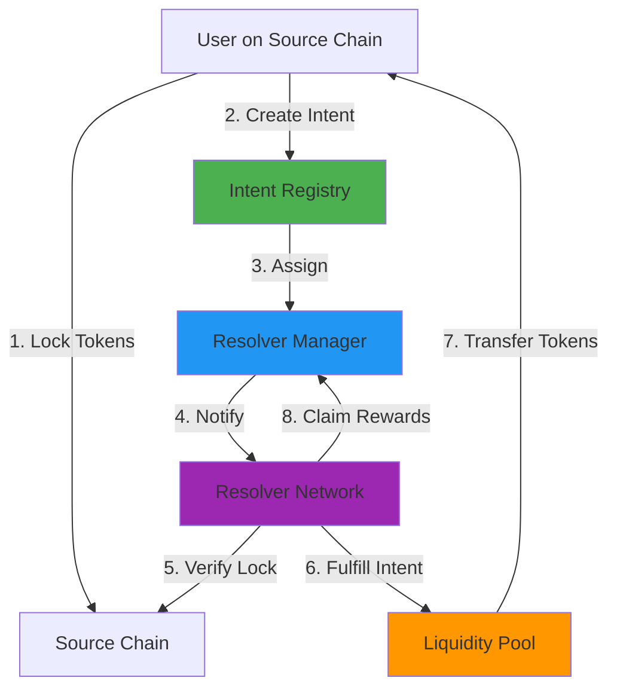
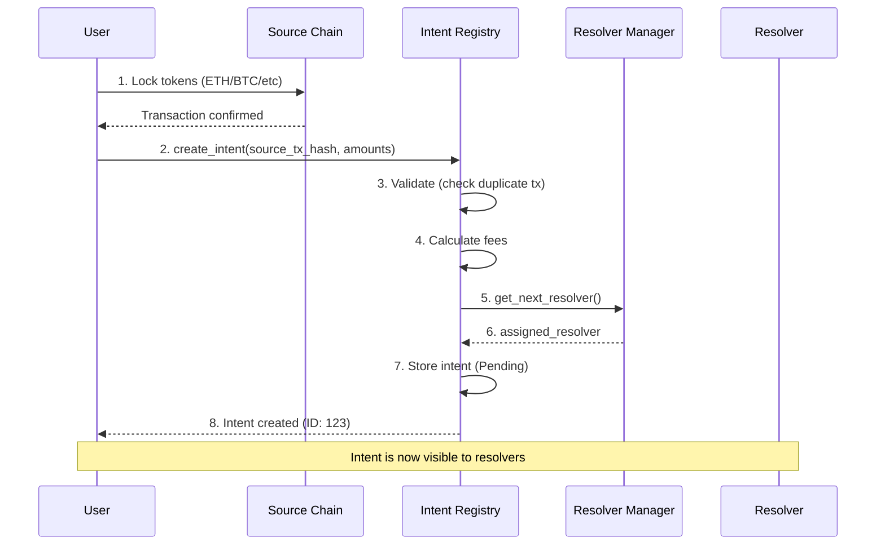
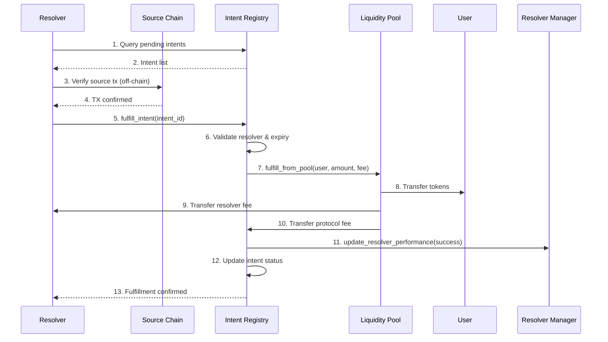
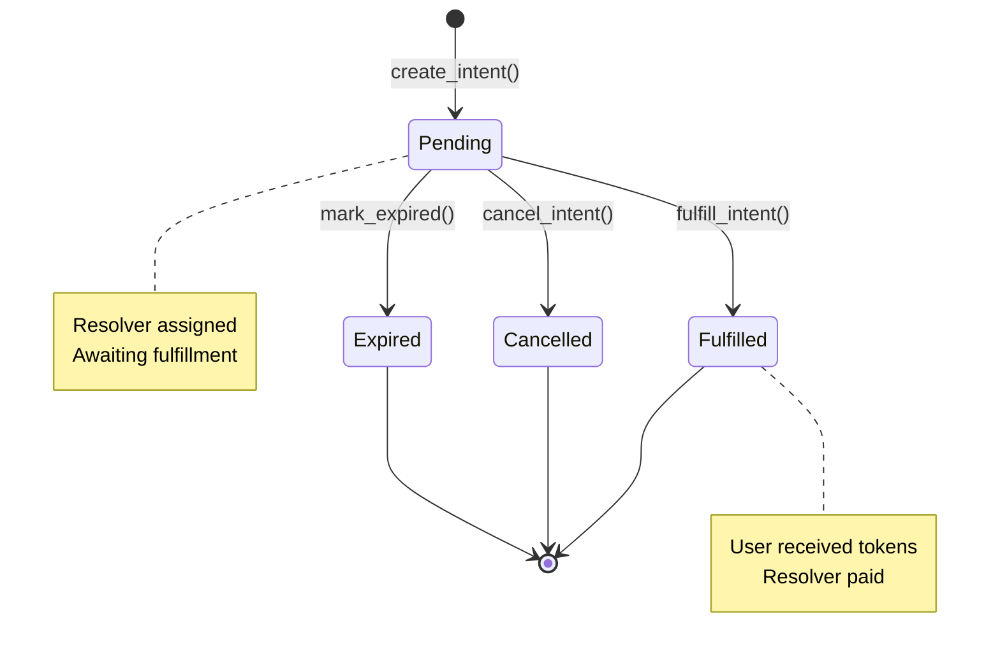

# Intent Protocol - Project Flow Documentation

## 📋 Overview

The Intent Protocol is a **cross-chain intent-based liquidity protocol** built on the Movement Network (Aptos-based). It enables users to express their desire to swap tokens across different blockchains, which are then fulfilled by a network of **resolvers** using liquidity pools.

### Key Concept
Instead of directly executing cross-chain swaps, users create **intents** that describe what they want. Resolvers compete to fulfill these intents in exchange for fees, providing instant liquidity while verification happens asynchronously.

---

## 🏗️ System Architecture



---

## 🔧 Core Components

### 1. **Intent Registry** ([intent_registry.move](file:///home/antony/intent-protocol/sources/intent_registry.move))
**Central orchestrator** of the entire protocol.

**Responsibilities:**
- Create and manage intents
- Validate source chain transactions
- Coordinate with resolver manager for assignment
- Handle intent lifecycle (pending → fulfilled/cancelled/expired)
- Manage fee collection and distribution
- Track transaction hashes to prevent double-spending

**Key Functions:**
- `initialize()` - Set up registry with fee config and supported chains
- `create_intent()` - Users create new cross-chain swap intents
- `fulfill_intent()` - Resolvers fulfill intents after verification
- `cancel_intent()` - Users/admins cancel pending intents
- `mark_expired()` - Anyone can mark expired intents

**State Management:**
```move
struct IntentRegistry {
    admin: address,
    intents: Table<u64, Intent>,
    next_intent_id: u64,
    used_tx_hashes: Table<vector<u8>, bool>,  // Anti-replay
    user_intents: Table<address, vector<u64>>,
    fee_config: FeeConfig,
    supported_chains: Table<u64, bool>,
    pool_address: address,
    resolver_registry: address,
    paused: bool,
}
```

---

### 2. **Intent Types** ([intent_types.move](file:///home/antony/intent-protocol/sources/intent_types.move))
**Data structures** for the protocol.

**Status:** ⚠️ Placeholder - Needs Implementation

**Required Structures:**
```move
struct Intent {
    id: u64,
    requester: address,
    
    // Source chain details
    source_chain_id: u64,
    source_token: vector<u8>,
    source_amount: u64,
    source_tx_hash: vector<u8>,
    source_block_number: u64,
    
    // Target chain details (Movement)
    target_token: vector<u8>,
    target_amount: u64,
    
    // Fulfillment
    assigned_resolver: address,
    status: u8,  // 0=Pending, 1=Fulfilled, 2=Cancelled, 3=Expired
    
    // Timing
    created_at: u64,
    expiry_at: u64,
    fulfilled_at: Option<u64>,
    
    // Fees
    fee_amount: u64,
    resolver_fee: u64,
    protocol_fee: u64,
}

struct FeeConfig {
    base_fee_bps: u64,      // Basis points (e.g., 30 = 0.3%)
    resolver_fee_bps: u64,  // % of fee going to resolver
    protocol_fee_bps: u64,  // % of fee going to protocol
    min_fee: u64,
    max_fee: u64,
}
```

---

### 3. **Resolver Manager** ([resolver_manager.move](file:///home/antony/intent-protocol/sources/resolver_manager.move))
**Manages theResolver Network** - entities that fulfill intents.

**Status:** ⚠️ Not Implemented

**Responsibilities:**
- Resolver registration and authorization
- Round-robin or stake-weighted assignment
- Track resolver performance (fulfillment rate, volume)
- Slashing for misbehavior
- Fee distribution

**Required Functions:**
```move
// Registration
public entry fun register_resolver(resolver: &signer, stake_amount: u64)
public entry fun deregister_resolver(resolver: &signer)

// Assignment
public fun get_next_resolver(registry: address): address

// Performance
public fun update_resolver_performance(
    registry: address,
    resolver: address,
    success: bool,
    volume: u64
)
public fun is_authorized_resolver(registry: address, resolver: address): bool

// Rewards
public entry fun claim_resolver_fees(resolver: &signer)
```

---

### 4. **Liquidity Pool** ([liquidity_pool.move](file:///home/antony/intent-protocol/sources/liquidity_pool.move))
**Provides instant liquidity** for intent fulfillment.

**Status:** ⚠️ Not Implemented

**Responsibilities:**
- Accept LP deposits
- Provide liquidity for intent fulfillment
- Distribute fees to LPs
- Track LP shares and balances

**Required Functions:**
```move
// LP Management
public entry fun deposit<CoinType>(lp: &signer, amount: u64)
public entry fun withdraw<CoinType>(lp: &signer, shares: u64)

// Intent Fulfillment
public fun fulfill_from_pool<CoinType>(
    pool_address: address,
    recipient: address,
    amount: u64,
    fee: u64
)

// Accounting
public fun calculate_lp_shares(deposit_amount: u64): u64
public fun get_lp_balance(lp: address): u64
```

---

### 5. **Events** ([events.move](file:///home/antony/intent-protocol/sources/events.move))
**Event emission** for off-chain indexing.

**Status:** ⚠️ Placeholder - Needs Implementation

**Required Events:**
```move
struct IntentCreated has drop, store {
    intent_id: u64,
    requester: address,
    source_chain_id: u64,
    source_token: vector<u8>,
    source_amount: u64,
    source_tx_hash: vector<u8>,
    target_amount: u64,
    assigned_resolver: address,
    expiry_at: u64,
    timestamp: u64,
}

struct IntentFulfilled has drop, store {
    intent_id: u64,
    requester: address,
    resolver: address,
    amount: u64,
    resolver_fee: u64,
    protocol_fee: u64,
    timestamp: u64,
}

struct IntentCancelled has drop, store {
    intent_id: u64,
    requester: address,
    cancelled_by: address,
    timestamp: u64,
    reason: vector<u8>,
}

struct IntentExpired has drop, store {
    intent_id: u64,
    requester: address,
    timestamp: u64,
}

struct EmergencyPause has drop, store {
    admin: address,
    timestamp: u64,
    reason: vector<u8>,
}

// LP Events
struct LiquidityDeposited has drop, store { ... }
struct LiquidityWithdrawn has drop, store { ... }

// Resolver Events
struct ResolverRegistered has drop, store { ... }
struct ResolverSlashed has drop, store { ... }
```

---

### 6. **Deposit Manager** ([deposit_manager.move](file:///home/antony/intent-protocol/sources/deposit_manager.move))
**Manages deposits** (if needed for escrow).

**Status:** ⚠️ Not Implemented

**Purpose:** May be used for:
- Escrow management for failed intents
- Managing protocol treasury
- Fee collection point

---

## 🔄 User Flow

### **Flow 1: Creating an Intent**



**Steps:**
1. **User locks tokens** on source chain (e.g., Ethereum)
2. **User calls** `create_intent()` with:
   - Source chain ID
   - Source token address
   - Source tx hash (proof of lock)
   - Target amount desired on Movement
   - Expiry duration
3. **Registry validates**:
   - Chain is supported ✓
   - Amount is valid ✓
   - TX hash not used before ✓
   - Expiry within limits ✓
4. **Registry calculates fees**:
   - Base fee (e.g., 0.3% = 30 bps)
   - Splits into resolver fee + protocol fee
5. **Resolver assigned** via Resolver Manager
6. **Intent stored** with status = Pending
7. **Event emitted** for off-chain indexers

---

### **Flow 2: Fulfilling an Intent**



**Steps:**
1. **Resolver monitors** pending intents (off-chain indexer)
2. **Resolver verifies** source chain transaction independently
3. **Resolver calls** `fulfill_intent(intent_id)`
4. **Registry validates**:
   - Intent exists and is pending ✓
   - Resolver is authorized ✓
   - Intent not expired ✓
   - Resolver matches assigned resolver ✓
5. **Liquidity Pool executes**:
   - Transfers `target_amount` to user
   - Deducts fees
6. **Fees distributed**:
   - Resolver receives `resolver_fee`
   - Protocol receives `protocol_fee`
7. **Intent marked** as Fulfilled
8. **Resolver stats updated** (volume, success rate)
9. **Event emitted**

---

### **Flow 3: Cancelling/Expiring Intents**

#### Cancel (Before Expiry)
- **Who:** User or Admin
- **When:** Intent is still pending
- **Effect:** Intent marked as Cancelled, no fulfillment possible

#### Expire (After Expiry)
- **Who:** Anyone (public function)
- **When:** Current time > expiry_at
- **Effect:** Intent marked as Expired, no fulfillment possible

---

## 💰 Fee Structure

### Fee Calculation
```
Total Fee = (Amount × base_fee_bps) / 10000
Total Fee = max(min_fee, min(Total Fee, max_fee))

Resolver Fee = (Total Fee × resolver_fee_bps) / 10000
Protocol Fee = Total Fee - Resolver Fee

Net Amount to User = Amount - Total Fee
```

### Example
```
Target Amount: 1,000,000 tokens
Base Fee: 30 bps (0.3%)
Resolver Share: 80% (8000 bps)
Protocol Share: 20% (2000 bps)

Total Fee = 1,000,000 × 0.003 = 3,000 tokens
Resolver Fee = 3,000 × 0.8 = 2,400 tokens
Protocol Fee = 3,000 × 0.2 = 600 tokens
User Receives = 1,000,000 - 3,000 = 997,000 tokens
```

---

## 🔐 Security Features

### 1. **Anti-Replay Protection**
- Tracks used transaction hashes in `used_tx_hashes` table
- Prevents same source tx from creating multiple intents

### 2. **Expiry Limits**
- Min expiry: 5 minutes (300 seconds)
- Max expiry: 24 hours (86400 seconds)
- Prevents indefinite pending intents

### 3. **Authorization Checks**
- Only assigned resolver can fulfill
- Only authorized resolvers in registry
- Admin-only functions (pause, fee updates)

### 4. **Emergency Controls**
- `pause()` - Admin can halt all operations
- `unpause()` - Admin can resume operations
- Events emitted for transparency

### 5. **Supported Chain Validation**
- Must explicitly add chains via `add_supported_chain()`
- Prevents intents from unknown chains

---

## 📊 Data Flow

### Intent Lifecycle State Machine



---

## 🚀 Deployment & Initialization

### Setup Sequence ([init_protocol.sh](file:///home/antony/intent-protocol/scripts/init_protocol.sh))

```bash
# 1. Initialize Deposit Manager
movement move run --function-id "${ACCOUNT}::deposit_manager::initialize"

# 2. Initialize Resolver Registry
movement move run --function-id "${ACCOUNT}::resolver_manager::initialize" \
  --args u64:1000000000 u64:100  # min_stake, max_resolvers

# 3. Initialize Intent Registry
movement move run --function-id "${ACCOUNT}::intent_registry::initialize" \
  --args \
    address:${POOL} \
    address:${RESOLVER_REGISTRY} \
    u64:30 u64:8000 u64:2000 \     # base_fee, resolver%, protocol%
    u64:100000 u64:10000000000      # min_fee, max_fee

# 4. Add Supported Chains
movement move run --function-id "${ACCOUNT}::intent_registry::add_supported_chain" \
  --args address:${REGISTRY} u64:1  # Ethereum mainnet

# 5. Register Resolvers
movement move run --function-id "${ACCOUNT}::resolver_manager::register_resolver" \
  --args u64:1000000000  # stake amount
```

---

## 🎯 Integration Points

### Off-Chain Components Needed

1. **Indexer/Relayer**
   - Listens to `IntentCreated` events
   - Monitors source chains for tx confirmations
   - Notifies resolvers of pending intents

2. **Resolver Client**
   - Queries pending intents
   - Verifies source chain transactions
   - Submits fulfillment transactions
   - Manages profitability calculations

3. **Frontend dApp**
   - User intent creation interface
   - Intent status tracking
   - LP management dashboard
   - Resolver analytics

4. **Oracle (Optional)**
   - Price feeds for cross-chain swaps
   - Exchange rate validation

---

## 📝 Current Implementation Status

| Component | Status | Priority |
|-----------|--------|----------|
| Intent Registry | ✅ Complete | High |
| Intent Types | ⚠️ Partial (placeholder) | Critical |
| Resolver Manager | ❌ Not Implemented | Critical |
| Liquidity Pool | ❌ Not Implemented | Critical |
| Events | ⚠️ Partial (placeholder) | High |
| Deposit Manager | ❌ Not Implemented | Medium |
| Tests | ⚠️ Basic only | High |
| Documentation | ✅ This Document | Medium |

---

## 🛠️ Next Steps

### Critical Path to MVP

1. **Complete `intent_types.move`**
   - Define full `Intent` struct
   - Implement all helper functions
   - Add status transition logic

2. **Implement `resolver_manager.move`**
   - Resolver registration
   - Assignment logic (round-robin)
   - Performance tracking
   - Fee distribution

3. **Implement `liquidity_pool.move`**
   - LP deposit/withdrawal
   - Fulfillment liquidity provision
   - Fee distribution to LPs
   - Share calculation

4. **Complete `events.move`**
   - All event structs
   - Emission helper functions

5. **Write Comprehensive Tests**
   - Full intent lifecycle
   - Multi-resolver scenarios
   - Edge cases (expiry, cancellation)
   - Fee calculation verification

6. **Build Off-Chain Indexer**
   - Event listening
   - Intent state tracking
   - Resolver notification system

---

## 📚 Additional Resources

### Movement Network
- **Testnet RPC:** `https://aptos.testnet.porto.movementlabs.xyz/v1`
- **Faucet:** `https://faucet.testnet.porto.movementlabs.xyz/`
- **Docs:** `https://docs.movementnetwork.xyz/`

### Project Structure
```
intent-protocol/
├── Move.toml                 # Package manifest
├── sources/
│   ├── intent_registry.move  # ✅ Main orchestrator
│   ├── intent_types.move     # ⚠️ Data structures
│   ├── resolver_manager.move # ❌ Resolver network
│   ├── liquidity_pool.move   # ❌ Liquidity provision
│   ├── events.move           # ⚠️  Event definitions
│   └── deposit_manager.move  # ❌ Escrow management
├── scripts/
│   ├── init_protocol.sh      # Deployment script
│   ├── deploy.sh             # Compilation & deploy
│   └── check_status.sh       # Status checker
└── tests/
    └── basic_tests.move      # Test suite
```

---

## 💡 Design Decisions

### Why Intent-Based?
- **Better UX:** Users don't need to wait for cross-chain confirmations
- **Instant Liquidity:** Resolvers provide immediate fulfillment
- **Competition:** Multiple resolvers compete for fees
- **Fault Tolerant:** Failed fulfillments can be reassigned

### Why Resolver Network?
- **Decentralization:** No single point of failure
- **Economic Incentives:** Resolvers earn fees for honest behavior
- **Scalability:** More resolvers = more capacity
- **Specialization:** Resolvers can specialize in certain chains

### Why Liquidity Pools?
- **Capital Efficiency:** Shared liquidity across all intents
- **Passive Income:** LPs earn fees without active participation
- **Resolver Flexibility:** Resolvers don't need to hold all tokens

---

## 🔍 Monitoring & Analytics

### Key Metrics to Track

**Protocol Health:**
- Total intents created
- Fulfillment rate (%)
- Average fulfillment time
- Total volume processed

**Resolver Performance:**
- Individual fulfillment rates
- Average response time
- Total fees earned
- Slashing events

**Liquidity Pool:**
- Total Value Locked (TVL)
- Utilization rate
- LP yields (APY)
- Fee revenue

**User Experience:**
- Average wait time
- Failed intent rate
- Cancellation rate
- Expiry rate

---

## ⚠️ Known Limitations

1. **Trust Assumptions:**
   - Users must trust resolvers to verify source chain correctly
   - Could add fraud proofs/dispute system in future

2. **Supported Chains:**
   - Currently manual chain addition by admin
   - Could be governance-based

3. **Resolver Assignment:**
   - Simple round-robin currently
   - Could add stake-weighting, reputation-based

4. **Liquidity:**
   - Bootstrap problem for initial LPs
   - May need protocol incentives

---

## 🎓 Glossary

- **Intent:** User's declaration of desired cross-chain swap
- **Resolver:** Entity that fulfills intents by providing liquidity
- **LP (Liquidity Provider):** Supplies capital to liquidity pool
- **BPS (Basis Points):** 1 bps = 0.01%, 100 bps = 1%
- **Source Chain:** Blockchain where user locks original tokens
- **Target Chain:** Movement Network (where user receives tokens)
- **Fulfillment:** Process of providing tokens to user
- **Expiry:** Deadline after which intent cannot be fulfilled

---

**Document Version:** 1.0  
**Last Updated:** 2025-12-29  
**Status:** Living Document