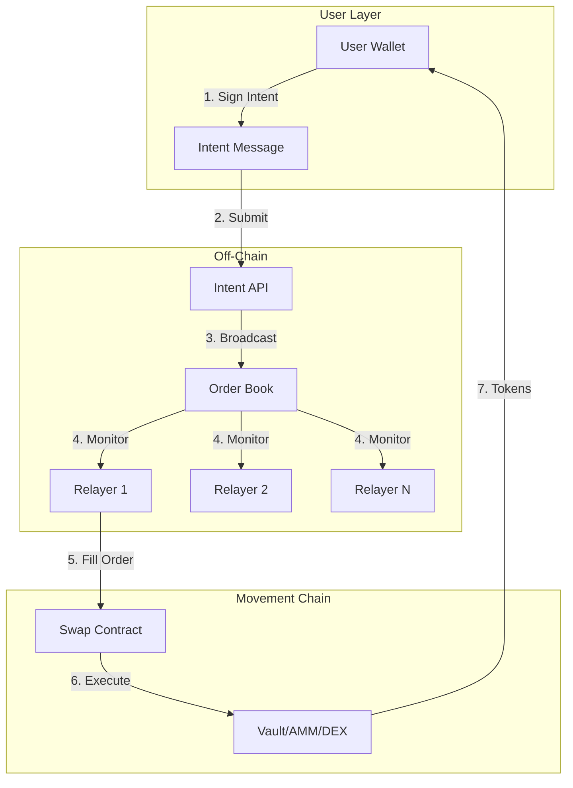

# Architecture

This document describes the high-level architecture of the Movement Intent Swap protocol.

## System Overview

The system consists of three main layers: the User Layer (intent creation), the Off-Chain Layer (order book & relayers), and the On-Chain Layer (Movement smart contracts).

## Core Components

### 1. Intent Message
A structured message signed by the user specifying their trade parameters. It includes:
*   **Maker**: User's address.
*   **Tokens**: Addresses of assets to sell and buy.
*   **Amounts**: Amount to sell and the starting/ending amounts to buy.
*   **Timing**: Start and end timestamps for the order validity.
*   **Signature**: Cryptographic proof of authorization.

### 2. Order Book (Off-Chain)
A service that aggregates user intents and broadcasts them to relayers. It acts as a mempool for intents.

### 3. Relayers
Bots or services that:
*   Monitor the order book.
*   Execute profitable trades by submitting transactions to the Movement Network.
*   Pay gas fees on behalf of the user.
*   Source liquidity from various on-chain or off-chain sources.

### 4. Swap Contract (On-Chain)
The core Move module that:
*   Verifies intent signatures.
*   Enforces Dutch Auction pricing logic.
*   Executes the token swap atomically.
*   Prevents replay attacks via nonces.

## Dutch Auction Pricing

Prices in the protocol are dynamic, determined by a Dutch Auction mechanism. This ensures competitive filling and price discovery.

The required buy amount decreases linearly over time:
`buyAmount(t) = startBuyAmount - (startBuyAmount - endBuyAmount) * (t - startTime) / (endTime - startTime)`

*   **User Benefit**: If relayers are competitive, the order fills early at a better price. If liquidity is low, the price drops until it becomes profitable for a relayer to fill.
*   **Relayer Incentive**: Relayers profit from the spread between the user's required `buyAmount` at time `t` and the actual market cost to acquire those tokens.

## Security Model

| Property | Mechanism |
| :--- | :--- |
| **Non-Custodial** | Users retain control of funds until the atomic swap. No intermediate custody. |
| **Replay Protection** | Each user has an on-chain nonce that increments with every successful fill. |
| **Signature Validity** | The contract verifies Ed25519/Secp256k1 signatures against the user's on-chain public key. |
| **Atomicity** | The swap (taking sell tokens, giving buy tokens) happens in a single transaction. If any part fails, the whole transaction reverts. |
| **MEV Protection** | Since orders are matched off-chain and the price parameters are fixed by the signed intent, users are protected from typical on-chain sandwich attacks. |

## Liquidity Sources

Relayers are agnostic to where they source liquidity. Common sources include:
1.  **On-Chain AMMs**: Liquidswap, Pontem, etc.
2.  **Private Inventory**: Relayer's own holdings.
3.  **Aggregators**: Routing through multiple on-chain pools.
