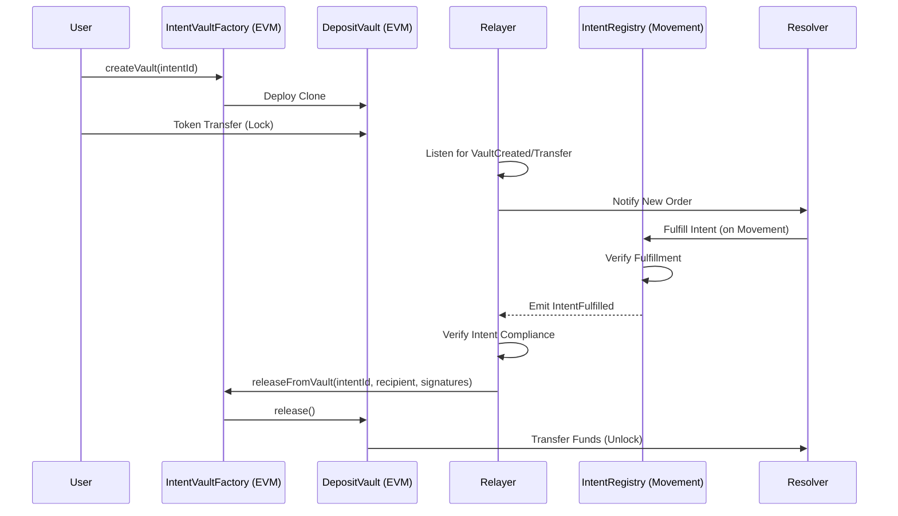

# Cross-Chain Architecture

The architecture relies on three main pillars: **Source Chain Vaults**, the **Relayer Service**, and the **Destination Chain Registry**.

## 🔄 System Flow

### Inbound: EVM (Source) → Movement (Destination)

This flow allows a user to move assets from an EVM chain into the Movement ecosystem.

### Outbound: Movement (Source) → EVM (Destination)

(Similar logic applies in reverse, where assets are locked on Movement and released on EVM).

## 🧩 Components

### 1. Intent Vaults (HTLCs)
Instead of a single massive liquidity pool, every intent gets its own **isolated smart contract vault**.
*   **Creation**: Deployed deterministically using `CREATE2` (on EVM) via `IntentVaultFactory`.
*   **Security**: Minimal Proxy (EIP-1167) for gas efficiency.
*   **Logic**: Holds funds for a fixed duration (e.g., 24 hours).
    *   **Release**: Requires `M-of-N` Relayer signatures proving the intent was fulfilled on destination.
    *   **Refund**: After expiry, the original user can reclaim their funds trustlessly.

### 2. Relayer Network
The "witnessing" layer. Relayers observe both the source and destination chains.
*   **Monitoring**: Indexes `VaultCreated` events on EVM and `IntentFulfilled` events on Movement.
*   **Signing**: If they see a valid fulfillment on the destination chain, they sign a message authorizing the release of funds on the source chain.
*   **Consensus**: A threshold (e.g., 2/3) of relayers must agree for funds to be moved.

### 3. Intent Registry (Movement)
The "truth" layer.
*   Acts as the settlement engine where Resolvers prove they have fulfilled the user's request.
*   Once an intent is marked as `Fulfilled`, it acts as the trigger for Relayers to unlock the source funds.

## 🛡️ Security Model

*   **No Central Validator**: The release authority is distributed among a decentralized set of Relayers (in V1) or proved via ZK/Light Clients (in V2).
*   **Atomic Guarantees**: Resolvers generally front the capital. If they fail to fulfill the intent on the destination, the User triggers `refundFromVault` after expiry, losing only time (and gas), not principal.
