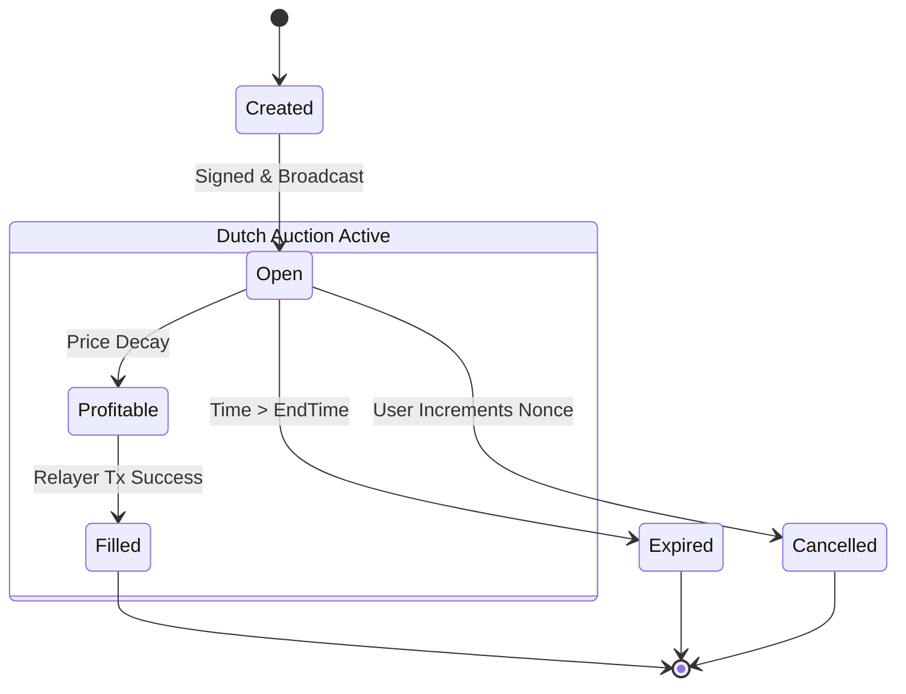

# User Flow & Lifecycle

This document provides a technical deep-dive into the lifecycle of a Movement Intent Swap, from creation to settlement.

## 1. Requirements (User Stories)

### As a User (Maker)
*   **I want to** swap tokens without paying gas on the source chain (if using gasless mode) or destination.
*   **I want to** sign a single off-chain message to open an order.
*   **I want to** know my **minimum guaranteed output** (slippage protection) before signing.
*   **I want to** have my order filled by the most competitive Relayer (best price).

### As a Relayer (Solver)
*   **I want to** monitor the order book for profitable opportunities.
*   **I want to** validate that an intent is solvent (user has funds) before attempting to fill.
*   **I want to** execute atomic fills where I only pay the user if I receive their funds.

---

## 2. The Lifecycle of an Intent

The intent lifecycle consists of 5 distinct phases:

### Phase 1: Quote & Construction
The Frontend interacts with the `IntentBuilder` SDK to construct the payload.
*   **Input**: User selects `SellToken`, `BuyToken`, and `SellAmount`.
*   **Quote**: Frontend fetches market rates (Pyth/DEX) to determine `StartBuyAmount` (Market + Premium) and `EndBuyAmount` (Market - Slippage).
*   **Decay**: The auction curve is set (e.g., linear decay over 10 minutes).

### Phase 2: Signing (EIP-712)
The User signs the structured data. This signature authorizes the `MovementContract` to move their funds **if and only if** the intent conditions are met.
*   **Domain**: Ensures signature is valid only for the specific Chain ID and Contract Address.
*   **Type**: `Intent(address maker,address sellToken,...)`

### Phase 3: Broadcasting
The signed intent is posted to the [Relayer API](./api_reference.md).
*   **Validation**: API checks signature validity and basic balance checks.
*   **Propagation**: The order is broadcast to all active Relayers via WebSocket/EventStream.

### Phase 4: The Dutch Auction (Off-Chain)
Relayers locally monitor the order. As time passes, the required `BuyAmount` decreases from `Start` to `End`.
1.  **Block N**: `Required = 105 USDC`. Market = 100 USDC. (Unprofitable, Relayers wait).
2.  **Block N+5**: `Required = 102 USDC`. Market = 100.5 USDC. (Unprofitable).
3.  **Block N+10**: `Required = 99.8 USDC`. Market = 100.2 USDC. (**Profitable!**)

### Phase 5: Settlement (On-Chain)
The first Relayer to find the order profitable submits a transaction to the Move Contract.
*   **Function**: `fill_order(intent, signature)`
*   **Atomic Swap**:
    1.  Contract verifies User Signature.
    2.  Contract calculates current Auction Price.
    3.  Contract transfers `SellAmount` from **User** to **Relayer**.
    4.  Contract transfers `BuyAmount` from **Relayer** to **User**.

---

## 3. Sequence Diagram

```mermaid
sequenceDiagram
    participant User
    participant Frontend
    participant API as Intent API
    participant Relayer
    participant Chain as Move Contract

    User->>Frontend: Request Swap Quote (100 MOVE -> USDC)
    Frontend->>Frontend: Calc Auction Params (Start: 105, End: 98, Time: 10m)
    Frontend->>User: Request EIP-712 Signature
    User->>Frontend: Sign Intent
    
    Frontend->>API: POST /orders { intent, signature }
    API-->>Relayer: Broadcast New Order
    
    loop Dutch Auction
        Relayer->>Relayer: Calc Current Price()
        Relayer->>Relayer: Check Profitability (Market vs Auction)
    end
    
    Relayer->>Chain: fill_order(intent) [Pay Gas]
    
    rect rgb(20, 20, 20)
        Note left of Chain: ATOMIC EXECUTION
        Chain->>Chain: Verify Signature
        Chain->>Chain: Verify Expiry & Nonce
        Chain->>Chain: Revert if Relayer Funds < Auction Price
        Chain->>Relayer: Transfer 100 MOVE (from User)
        Chain->>User: Transfer 99.8 USDC (from Relayer)
    end
    
    Chain-->>API: Emit Event "OrderFilled"
    API->>Frontend: WebSocket "Order Filled"
    Frontend->>User: Notification "Swap Complete!"
```

---

## 4. State Machine

An intent is a stateful object tracked primarily off-chain, but finalized on-chain.

*   **Open**: Valid, authorized, waiting for a taker.
*   **Filled**: Terminal state. Executed on-chain.
*   **Expired**: Terminal state. No longer valid due to timestamp.
*   **Cancelled**: Terminal state. Invalidated by user action (nonce bump).
