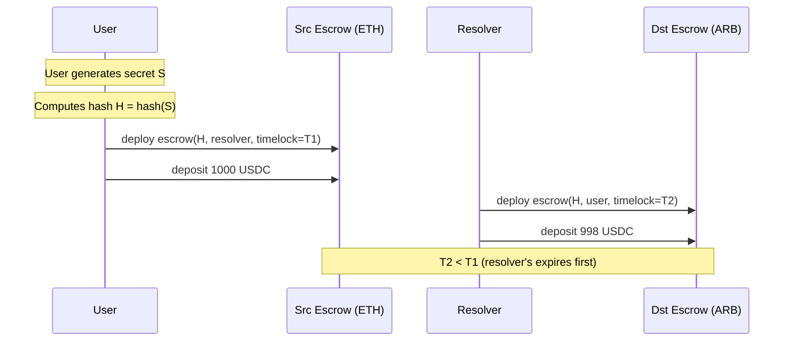
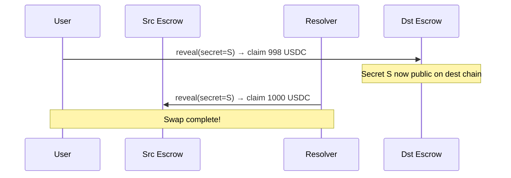
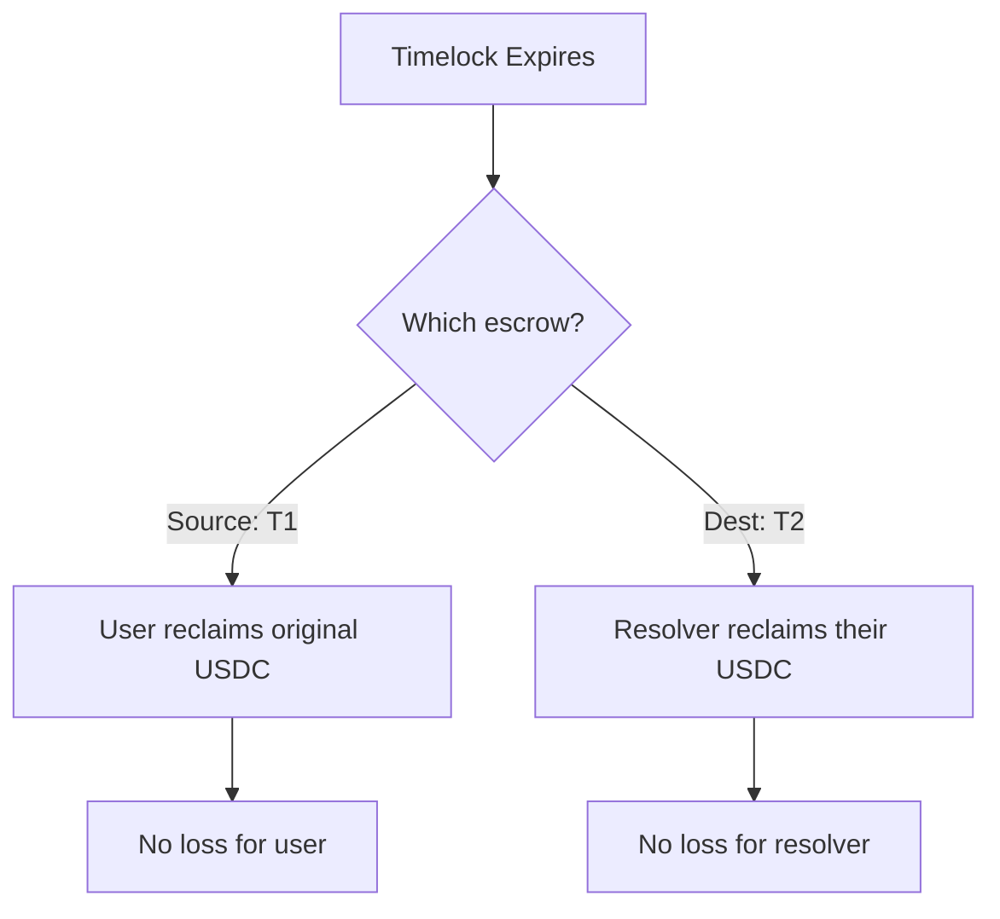

# Fusion+ Cross-Chain Technical Deep Dive

> Technical analysis of 1inch Fusion+ for implementing Movement ↔ EVM cross-chain swaps.

---

## HTLC (Hashed Timelock Contract) Mechanism

### Core Concept

HTLCs enable **atomic swaps** - transactions that either complete entirely or not at all, with no trust required between parties.

### HTLC Parameters

```solidity
struct HTLC {
    bytes32 hashlock;      // Hash of secret (SHA256)
    uint256 timelock;      // Expiry timestamp
    address sender;        // Who locked funds
    address recipient;     // Who can claim with secret
    address token;         // ERC20 token address
    uint256 amount;        // Locked amount
    bool claimed;          // Already claimed?
    bool refunded;         // Already refunded?
}
```

### Security Properties

| Property | Description |
|----------|-------------|
| **Atomicity** | Both sides complete or neither does |
| **Trustless** | No third party holds funds |
| **Time-bounded** | Timelocks prevent indefinite locks |
| **Cryptographic** | Secret revelation enables claims |

---

## Fusion+ Cross-Chain Flow

### Phase 1: Order Creation

```
User signs intent:
{
  srcChain: "ethereum",
  dstChain: "arbitrum",
  srcToken: "USDC",
  dstToken: "USDC",
  amount: 1000,
  minReceive: 998,
  deadline: block.timestamp + 1 hour
}
```

### Phase 2: Escrow Deposits



### Phase 3: Atomic Swap



### Phase 4: Recovery (if failed)



---

## Timelock Safety

### Critical: Timelock Ordering

```
T2 < T1 (Destination expires before Source)
```

**Why?**
1. User claims on destination first (reveals secret)
2. Resolver sees secret, claims on source
3. If destination expired first and resolver couldn't claim, user already has secret to claim source funds

### Recommended Values

| Duration | Use Case |
|----------|----------|
| 15-30 min | Same-chain, fast finality |
| 1-2 hours | Cross-chain, normal |
| 6-24 hours | Cross-chain, slow finality chains |

---

## Smart Contract Interface

### Source Chain (EVM)

```solidity
interface ISourceEscrow {
    /// @dev Create new escrow
    function createEscrow(
        bytes32 hashlock,
        address resolver,
        address token,
        uint256 amount,
        uint256 timelock
    ) external returns (bytes32 escrowId);
    
    /// @dev Resolver claims with secret
    function claim(
        bytes32 escrowId,
        bytes32 secret
    ) external;
    
    /// @dev User refunds after timelock
    function refund(bytes32 escrowId) external;
}
```

### Destination Chain (Movement)

```move
module fusion::escrow {
    struct Escrow has key {
        hashlock: vector<u8>,
        maker: address,
        resolver: address,
        amount: u64,
        timelock: u64,
        claimed: bool,
        refunded: bool,
    }
    
    /// Create escrow on destination
    public entry fun create_escrow(
        resolver: &signer,
        hashlock: vector<u8>,
        maker: address,
        amount: u64,
        timelock: u64,
    );
    
    /// User claims with secret
    public entry fun claim(
        maker: &signer,
        escrow_id: address,
        secret: vector<u8>,
    );
    
    /// Resolver refunds after timelock
    public entry fun refund(
        resolver: &signer,
        escrow_id: address,
    );
}
```

---

## Secret Management

### Secret Generation

```typescript
// Generate cryptographically secure secret
const secret = crypto.randomBytes(32);
const hashlock = crypto.createHash('sha256').update(secret).digest();

// User keeps secret private until claiming
```

### Hash Verification

```solidity
function verifySecret(bytes32 hashlock, bytes32 secret) pure returns (bool) {
    return sha256(abi.encodePacked(secret)) == hashlock;
}
```

```move
public fun verify_secret(hashlock: vector<u8>, secret: vector<u8>): bool {
    let computed = hash::sha2_256(secret);
    computed == hashlock
}
```

---

## Resolver Economics for Cross-Chain

### Cost Structure

| Cost | Description |
|------|-------------|
| Gas (source) | Creating escrow |
| Gas (dest) | Creating escrow + claiming |
| Capital lockup | Funds locked during swap |
| Risk premium | Failed swap recovery time |

### Profit Calculation

```
Profit = UserAmount - ReturnAmount - GasCosts - RiskPremium

Example:
User sends: 1000 USDC
Resolver provides: 998 USDC
Gas costs: ~$1.50
Risk premium: ~$0.30
Profit: $0.20 per swap
```

### Volume Required

At $0.20 profit/swap, resolver needs:
- 5,000 swaps/month = $1,000/month revenue
- Must balance capital efficiency across chains

---

## Movement-Specific Considerations

### Finality

| Chain | Finality Time | Recommended Timelock |
|-------|---------------|---------------------|
| Movement | ~2-3 seconds | 15-30 minutes |
| Ethereum | ~12 minutes | 2-4 hours |
| BSC | ~3 seconds | 15-30 minutes |

### Gas Optimization

Movement uses Gas Unit pricing differently:
```move
// Optimize by batching operations
public entry fun batch_process_escrows(
    resolver: &signer,
    escrow_ids: vector<address>,
    secrets: vector<vector<u8>>,
) {
    let len = vector::length(&escrow_ids);
    let i = 0;
    while (i < len) {
        let id = *vector::borrow(&escrow_ids, i);
        let secret = *vector::borrow(&secrets, i);
        claim_internal(resolver, id, secret);
        i = i + 1;
    }
}
```

---

## Security Checklist

- [ ] Timelocks properly ordered (dest < source)
- [ ] Secret is 32 bytes, cryptographically random
- [ ] Hash function matches on both chains (SHA256)
- [ ] Escrow cannot be claimed AND refunded
- [ ] Amount checks prevent underflow/overflow
- [ ] Token approval checked before deposit
- [ ] Events emitted for all state changes
- [ ] Reentrancy guards in place (EVM side)

---

## Implementation Roadmap

1. **Phase 1**: Single-chain HTLC escrow (Movement)
2. **Phase 2**: Cross-chain HTLC (Movement ↔ EVM)
3. **Phase 3**: Resolver competition layer
4. **Phase 4**: Dutch auction integration

---

*Technical deep dive for Intent Protocol cross-chain implementation*
