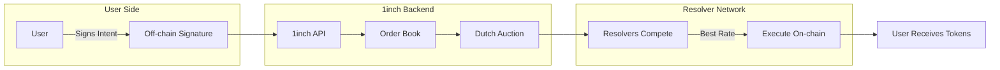
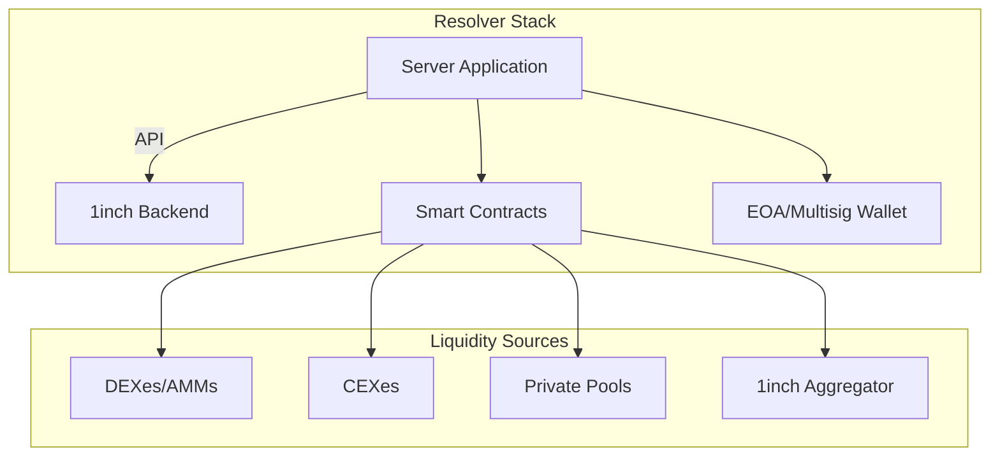
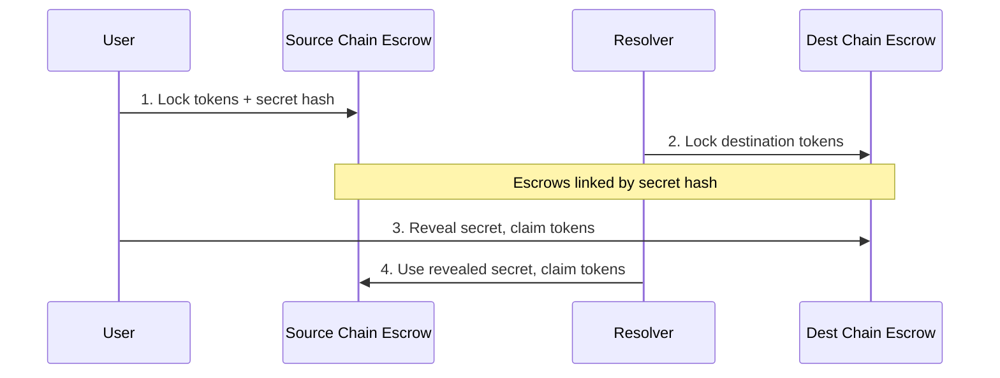
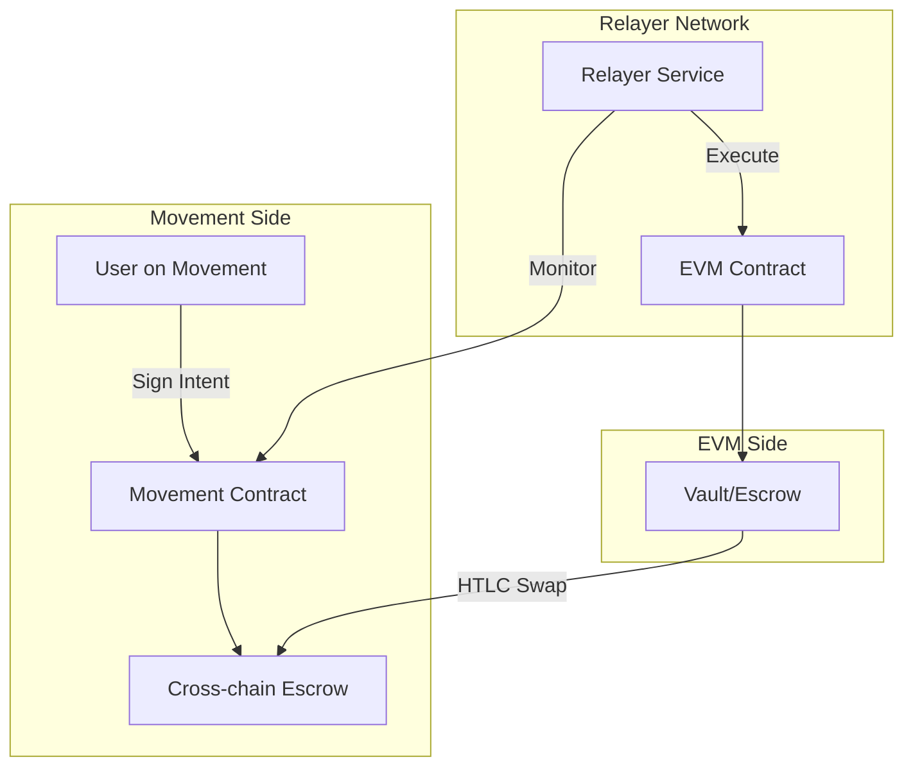

# 1inch Fusion Swap - Research Notes

> **Purpose**: Research documentation for implementing intent-based swaps on Movement, inspired by 1inch's Fusion mechanism.

---

## Overview

1inch Fusion Swap is an **intent-based** token swapping mechanism that offers:
- **Gasless transactions** for users
- **MEV protection** (front-running, sandwich attacks)
- **Competitive pricing** via Dutch auction
- **Cross-chain support** (Fusion+) using HTLCs

---

## Core Architecture



### Key Components

| Component | Description |
|-----------|-------------|
| **User Intent** | Off-chain signed order specifying tokens, amounts, price range, time window |
| **1inch API** | Relays intents to order book, manages auction |
| **Order Book** | Stores active orders for resolvers to fill |
| **Resolvers** | Professional market makers who execute trades |
| **Dutch Auction** | Price discovery mechanism (price decreases over time) |
| **Escrow Contracts** | For cross-chain (Fusion+) - HTLCs on source/destination |

---

## How Fusion Swap Works

### Step-by-Step Flow

1. **User Creates Intent**
   - Specifies: source token, destination token, amount, min acceptable return
   - Signs order off-chain (no gas cost)
   - Intent includes price range and time window

2. **Dutch Auction Begins**
   - Order sent to 1inch API → Order Book
   - Price starts HIGH (favorable for user, unfavorable for resolver)
   - Price gradually **decreases** over time window

3. **Resolver Competition**
   - Resolvers monitor order book
   - Compete to fill when price becomes profitable
   - Must fill within user's acceptable parameters

4. **Execution**
   - Winning resolver executes on-chain transaction
   - **Resolver pays gas fees** (gasless for user)
   - User receives tokens

### Price Discovery (Dutch Auction)

```
Price
  ↑
  │ ████░░░░░░░░░░░░░░░░░░  ← Start: High (user-favorable)
  │ ░░░░████░░░░░░░░░░░░░░
  │ ░░░░░░░░████░░░░░░░░░░  ← Resolvers compete here
  │ ░░░░░░░░░░░░████░░░░░░
  │ ░░░░░░░░░░░░░░░░████░░  ← End: Low (user's minimum)
  └──────────────────────→ Time
```

---

## Resolvers

### What Are Resolvers?
Professional market makers / automated systems that:
- Monitor order book for profitable opportunities
- Execute trades on behalf of users
- Pay all gas fees
- Source liquidity from multiple venues

### Resolver Requirements
- **Stake 1INCH tokens** (collateral)
- **KYC/KYB verification**
- **Account screening** for illicit activities
- Can receive delegated "Unicorn Power" from other stakers

### Resolver Infrastructure



### Resolver Economics
- Profit from spread between user's acceptable rate and actual execution
- Must balance: gas costs, slippage, competition, timing

---

## Fusion+ (Cross-Chain Swaps)

### How Fusion+ Works

Uses **Hashed Timelock Contracts (HTLCs)** for trustless cross-chain swaps:



### Fusion+ Phases

| Phase | Description |
|-------|-------------|
| **Announcement** | User signs Fusion+ order, Dutch auction begins |
| **Deposit** | Resolver deposits to escrows on both chains |
| **Withdrawal** | Secret revealed, both parties claim tokens |
| **Recovery** | If failed, timelock expires, funds returned |

### Key Properties
- **No bridges required** - eliminates bridge vulnerabilities
- **Atomic execution** - all-or-nothing
- **Self-custody** - users never lose control of assets
- **MEV protected** - same as single-chain

---

## Intents System

### What is an Intent?

```typescript
interface SwapIntent {
  // What user wants
  sourceToken: Address;
  destinationToken: Address;
  sourceAmount: BigNumber;
  
  // Acceptable conditions
  minDestinationAmount: BigNumber;
  priceRange: { start: BigNumber; end: BigNumber };
  timeWindow: { start: number; duration: number };
  
  // User signature
  signature: Signature;
}
```

### Intent vs Transaction

| Aspect | Traditional TX | Intent |
|--------|---------------|--------|
| Specifies | Exact steps | Desired outcome |
| Gas | User pays | Resolver pays |
| Routing | User decides | Resolver optimizes |
| MEV Risk | High | Protected |
| Complexity | User handles | Abstracted |

---

## Application to Movement Intent Swap

### Lessons for Movement Implementation

1. **Intent Architecture**
   - Off-chain signed orders reduce gas costs
   - Users specify outcomes, not execution paths
   - Relayers/resolvers handle execution

2. **Resolver/Relayer Model**
   - Competitive market for order execution
   - Staking for accountability
   - Multi-source liquidity aggregation

3. **Cross-Chain (EVM ↔ Movement)**
   - Use HTLC-based atomic swaps
   - Escrow contracts on both chains
   - No reliance on bridges

4. **Dutch Auction Benefits**
   - Fair price discovery
   - Competitive resolver incentives
   - Time-based price flexibility

### Proposed Movement Architecture



---

## Key Takeaways

1. **Intent-based = UX improvement** - Users don't need to understand routing
2. **Gasless = Adoption driver** - Remove friction for new users
3. **Resolvers create market** - Competition ensures best rates
4. **Dutch auction = Fair pricing** - Balances user/resolver interests
5. **HTLCs for cross-chain** - Trustless, no bridge risk
6. **MEV protection built-in** - Resolvers bundle transactions

---

## References

- [1inch Fusion Documentation](https://docs.1inch.io/docs/fusion-swap/introduction)
- [1inch Developer Portal](https://1inch.dev/)
- [1inch Fusion Whitepaper](https://1inch.io/fusion/)
- [1inch GitHub - Atomic Swap Contracts](https://github.com/1inch)

---

*Research compiled: January 8, 2026*
*For: Intent Protocol on Movement*
