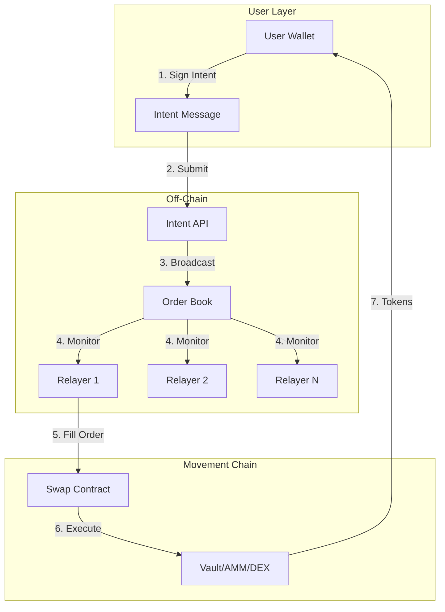
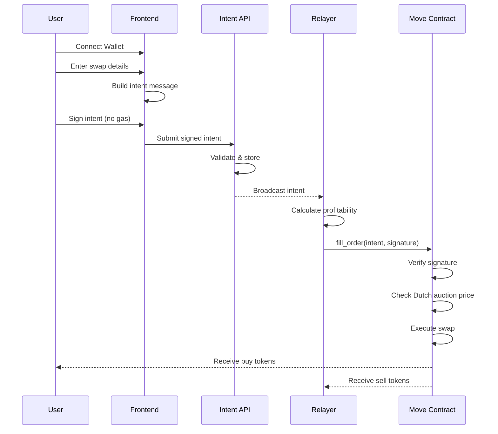
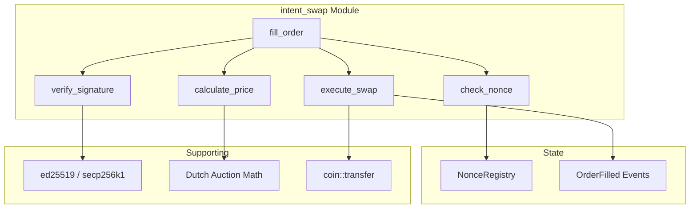
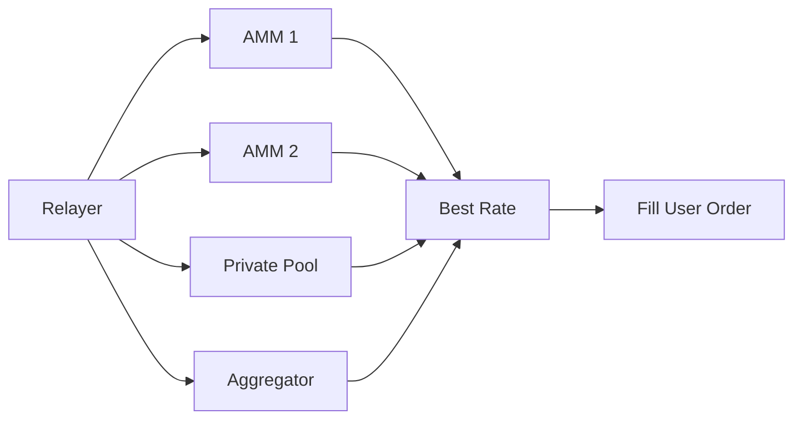

# Movement Intent Swap - Architecture

> Intent-based token swapping on Movement Network with gasless UX and competitive pricing.

---

## System Overview



---

## Core Components

### 1. Intent Message

Users sign an off-chain message specifying their swap intent:

```typescript
interface SwapIntent {
  // Identity
  maker: string;              // User's Movement address
  nonce: bigint;              // Unique per-user, prevents replay
  
  // Swap details
  sellToken: string;          // Token to sell (e.g., MOVE)
  buyToken: string;           // Token to buy (e.g., USDC)
  sellAmount: bigint;         // Amount to sell
  
  // Pricing (Dutch Auction)
  startBuyAmount: bigint;     // Initial ask (high for user)
  endBuyAmount: bigint;       // Minimum acceptable
  startTime: bigint;          // Auction start timestamp
  endTime: bigint;            // Auction end timestamp
  
  // Signature
  signature: string;          // User's signature over intent
}
```

### 2. Order Book (Off-Chain)

Centralized or P2P service that:
- Receives signed intents from users
- Broadcasts to registered relayers
- Tracks order status (open, filled, expired)

### 3. Relayers

Off-chain services that:
- Monitor order book for profitable orders
- Calculate optimal fill prices
- Submit fill transactions to Movement
- Pay gas fees on behalf of users

### 4. Swap Contract (On-Chain)

Move module that:
- Verifies intent signatures
- Enforces Dutch auction pricing
- Executes atomic swaps
- Prevents replay attacks

---

## Dutch Auction Pricing

Price decreases linearly from `startBuyAmount` to `endBuyAmount`:

```
buyAmount(t) = startBuyAmount - (startBuyAmount - endBuyAmount) * (t - startTime) / (endTime - startTime)
```

```
Buy Amount
    ↑
100 │████
    │    ████
 80 │        ████  ← Relayer fills here (profitable)
    │            ████
 60 │                ████  ← User's minimum
    └─────────────────────→ Time
    Start              End
```

**Example:**
- User sells 100 MOVE for USDC
- Start: wants 100 USDC (1:1)
- End: accepts 95 USDC (minimum)
- Relayer fills at t=50%: pays 97.5 USDC, keeps 2.5 USDC spread

---

## Component Architecture

### User Flow



### Contract Architecture



---

## Security Model

### On-Chain Guarantees

| Property | Mechanism |
|----------|-----------|
| **Signature validity** | ed25519/secp256k1 verification |
| **Replay protection** | Nonce tracking per maker |
| **Price protection** | Dutch auction boundary checks |
| **Atomicity** | Single transaction execution |
| **No custody** | Direct token transfers |

### Off-Chain Considerations

| Risk | Mitigation |
|------|------------|
| Order book unavailable | Decentralized order book / P2P gossip |
| Relayer collusion | Multiple competing relayers |
| Front-running | Fast finality (~2-3s), batch execution |
| Censorship | Multiple API endpoints |

---

## Comparison: Intent Swap vs Traditional DEX

| Aspect | Traditional DEX | Intent Swap |
|--------|-----------------|-------------|
| Gas payment | User pays | Relayer pays |
| Price discovery | AMM curve | Dutch auction |
| MEV risk | High (sandwich) | Low (off-chain) |
| Execution | User submits TX | Relayer submits |
| Complexity for user | High | Sign only |
| Liquidity source | Single AMM | Any (aggregated) |

---

## Liquidity Sources

Relayers can source liquidity from:

1. **On-chain AMMs** (e.g., PontemSwap, Liquidswap)
2. **Private liquidity** (relayer's own inventory)
3. **Other DEXs** on Movement
4. **Cross-DEX arbitrage** for better rates



---

## Gas Economics

### User Perspective
- **$0 gas** - Relayer covers all costs
- Trade-off: Slightly wider spread

### Relayer Perspective
```
Profit = Spread - GasCost

Where:
  Spread = SellAmount * MarketPrice - BuyAmountPaid
  GasCost ≈ 0.001 - 0.01 MOVE per fill
```

### Break-even Analysis
```
MinSpread = GasCost / SellAmount

Example:
  GasCost = 0.005 MOVE ≈ $0.05
  SellAmount = 100 USDC
  MinSpread = 0.05% to break even
```

---

## Scalability

### Order Throughput

| Component | Bottleneck | Solution |
|-----------|------------|----------|
| Order Book | Memory/Network | Horizontal scaling |
| Relayers | Capital | Multiple relayers |
| On-chain | Block space | Batch fills |

### Batching Multiple Orders

```move
public entry fun batch_fill(
    relayer: &signer,
    intents: vector<Intent>,
    signatures: vector<vector<u8>>,
) {
    let i = 0;
    while (i < vector::length(&intents)) {
        fill_order_internal(
            relayer,
            *vector::borrow(&intents, i),
            *vector::borrow(&signatures, i),
        );
        i = i + 1;
    };
}
```

---

## Next Steps

1. → [SMART_CONTRACTS.md](./SMART_CONTRACTS.md) - Detailed Move module design
2. → [RELAYER_DESIGN.md](./RELAYER_DESIGN.md) - Off-chain service architecture
3. → [USER_FLOW.md](./USER_FLOW.md) - Frontend integration guide
