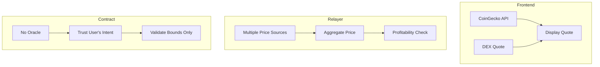

# Price Oracle Considerations

> Where and how price data is needed in the Movement Intent Swap system.
> **Decision: Using Pyth Network for price feeds.**

---

## TL;DR

| Component | Needs Oracle? | Source |
|-----------|--------------|--------|
| **Smart Contract** | ❌ No | User defines price in intent |
| **Relayer** | ✅ Yes | **Pyth Network** (primary) |
| **Frontend** | ✅ Yes | **Pyth Network** + DEX backup |

---

## Why the Contract Doesn't Need an Oracle

The smart contract is **oracle-free** by design:

```move
// User's intent already contains price expectations
struct Intent {
    sell_amount: u64,
    start_buy_amount: u64,   // User sets this
    end_buy_amount: u64,     // User sets this minimum
}

// Contract just validates:
// 1. Is the relayer's offer >= required amount? ✓
// 2. Is the intent properly signed? ✓
```

**Benefits of oracle-free contracts:**
- No oracle manipulation risk
- No dependency on external systems
- User has full control over their price
- Simpler, more auditable code

---

## Where Price Data IS Needed

### 1. Frontend (Quote Display)

```typescript
// When user enters "100 MOVE", show expected USDC output
const quote = await getQuote({
  sellToken: 'MOVE',
  buyToken: 'USDC',
  sellAmount: 100,
});

// Display: "You receive: ~85 USDC"
```

**Sources:**
- DEX quotes (PontemSwap, Liquidswap)
- Price aggregators (CoinGecko, DeFiLlama)
- On-chain TWAP oracles (Pyth, Switchboard)

### 2. Frontend (Intent Defaults)

```typescript
function calculateIntentParams(sellAmount: number, slippage: number) {
  // Get current market price
  const price = await getMarketPrice('MOVE', 'USDC');
  
  const expectedOutput = sellAmount * price;
  const startBuyAmount = expectedOutput * 1.001;  // Slight premium
  const endBuyAmount = expectedOutput * (1 - slippage);  // User's minimum
  
  return { startBuyAmount, endBuyAmount };
}
```

### 3. Relayer (Profitability)

```typescript
async function isProfitable(intent: Intent): Promise<boolean> {
  // Get real-time price to value the tokens
  const sellTokenPrice = await getPrice(intent.sellToken);
  const buyTokenPrice = await getPrice(intent.buyToken);
  
  // Calculate value of tokens we receive
  const sellValue = intent.sellAmount * sellTokenPrice;
  
  // Calculate cost to acquire buy tokens
  const buyAmountNeeded = getCurrentDutchAuctionPrice(intent);
  const buyCost = buyAmountNeeded * buyTokenPrice;
  
  // Calculate gas cost
  const gasCost = await estimateGas() * await getMovePrice();
  
  // Profit = value received - cost paid - gas
  const profit = sellValue - buyCost - gasCost;
  
  return profit > MIN_PROFIT_THRESHOLD;
}
```

---

## Oracle Options for Movement

### 1. Pyth Network

```move
// On-chain price feed
module oracle::pyth_adapter {
    use pyth::pyth;
    use pyth::price_identifier;
    
    const MOVE_USD_PRICE_ID: vector<u8> = x"...";
    
    public fun get_move_price(): (u64, u64, u64) {
        let price = pyth::get_price(MOVE_USD_PRICE_ID);
        (
            price.price,
            price.conf,
            price.expo
        )
    }
}
```

**Pros:** Low latency, widely used
**Cons:** Requires integration, potential trust in Pyth network

### 2. On-Chain DEX TWAP

```move
// Calculate time-weighted average price from DEX
module oracle::twap {
    public fun get_twap<X, Y>(
        pool: &Pool<X, Y>,
        window_seconds: u64,
    ): u64 {
        let observations = pool.observations;
        let current = timestamp::now_seconds();
        
        // Find observation at window start
        let start_obs = find_observation(observations, current - window_seconds);
        let end_obs = get_latest_observation(observations);
        
        // TWAP = (cumulative_end - cumulative_start) / time_delta
        (end_obs.cumulative - start_obs.cumulative) / window_seconds
    }
}
```

**Pros:** Fully on-chain, manipulation resistant
**Cons:** Requires DEX liquidity, can lag market

### 3. Off-Chain Price Feeds (Relayer Only)

```typescript
// Relayers can use any price source
const priceProviders = {
  coingecko: async (token: string) => {
    const res = await fetch(`https://api.coingecko.com/api/v3/simple/price?ids=${token}&vs_currencies=usd`);
    return res.json();
  },
  
  dexScreener: async (pairAddress: string) => {
    const res = await fetch(`https://api.dexscreener.com/latest/dex/pairs/movement/${pairAddress}`);
    return res.json();
  },
  
  directDex: async (tokenA: string, tokenB: string, amount: bigint) => {
    // Query DEX directly for quote
    const quote = await pontemSwap.getQuote(tokenA, tokenB, amount);
    return quote.outputAmount / Number(amount);
  },
};
```

---

## Hybrid Approach (Recommended)



**Why hybrid?**
- Contract stays simple and secure
- Relayers handle price complexity
- Frontend can use fast, free APIs
- No single point of failure

---

## Price Manipulation Protections

### Attack: Manipulate price to make relayer fill at bad rate

**Protection:** Relayers use multiple sources

```typescript
async function getSafePrice(token: string): Promise<number> {
  const prices = await Promise.all([
    getCoingeckoPrice(token),
    getDexScreenerPrice(token),
    getOnChainTwapPrice(token),
    getPythPrice(token),
  ]);
  
  // Reject if sources diverge too much
  const median = calculateMedian(prices);
  const maxDeviation = 0.02; // 2%
  
  for (const price of prices) {
    if (Math.abs(price - median) / median > maxDeviation) {
      throw new Error('Price sources diverge - possible manipulation');
    }
  }
  
  return median;
}
```

### Attack: User sets unrealistic intent price

**Protection:** Frontend warns, relayers won't fill

```typescript
// Frontend validation
function validateIntent(intent: Intent) {
  const marketPrice = await getMarketPrice(intent.sellToken, intent.buyToken);
  const impliedPrice = intent.startBuyAmount / intent.sellAmount;
  
  if (impliedPrice > marketPrice * 1.1) {
    return { warning: 'Your asking price is 10%+ above market. Order may not fill.' };
  }
  
  if (impliedPrice < marketPrice * 0.8) {
    return { error: 'Your asking price is too far below market. Please adjust.' };
  }
  
  return { ok: true };
}
```

---

## Summary

| Use Case | Recommended Source | Fallback |
|----------|-------------------|----------|
| Frontend quotes | CoinGecko API | DEX quote |
| Frontend defaults | DEX spot price | Pyth |
| Relayer profitability | Aggregate (3+ sources) | Conservative estimate |
| Contract validation | None (user-defined) | N/A |

**Key insight:** The Dutch auction mechanism means relayers have natural protection - they only fill when profitable according to *their* price source. If their price is wrong, they lose money. This aligns incentives without requiring an on-chain oracle.

---

## Implementation Checklist

- [ ] Frontend: Integrate CoinGecko/DeFiLlama API for quotes
- [ ] Frontend: Add DEX quote fallback (PontemSwap SDK)
- [ ] Relayer: Implement multi-source price aggregation
- [ ] Relayer: Add price divergence alerts
- [ ] Optional: On-chain TWAP oracle for advanced use cases
- [ ] Optional: Pyth integration for real-time on-chain prices

---

*Price oracle considerations for Movement Intent Swap*
