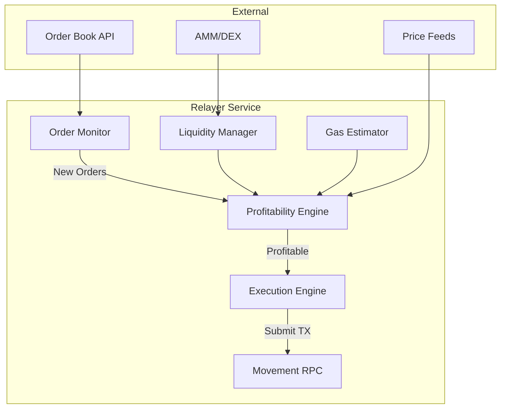

# Movement Intent Swap - Relayer Design

> Off-chain relayer service for filling intent orders on Movement Network.

---

## Relayer Overview



---

## Architecture

### Component Overview

| Component | Responsibility |
|-----------|----------------|
| **Order Monitor** | Subscribe to order book, fetch new intents |
| **Profitability Engine** | Calculate if order is profitable to fill |
| **Execution Engine** | Build and submit fill transactions |
| **Liquidity Manager** | Track available tokens across sources |
| **Gas Estimator** | Estimate transaction costs |

---

## Relayer Implementation (TypeScript)

### Project Structure

```
relayer/
├── src/
│   ├── index.ts              # Entry point
│   ├── config.ts             # Configuration
│   ├── monitor/
│   │   └── orderMonitor.ts   # Order book subscription
│   ├── engine/
│   │   ├── profitability.ts  # Profit calculations
│   │   └── execution.ts      # TX submission
│   ├── liquidity/
│   │   └── manager.ts        # Liquidity tracking
│   ├── utils/
│   │   ├── intent.ts         # Intent parsing/hashing
│   │   └── movement.ts       # Movement SDK helpers
│   └── types/
│       └── index.ts          # TypeScript types
├── package.json
└── .env
```

### Configuration

```typescript
// src/config.ts
export const config = {
  // Movement Network
  movement: {
    rpcUrl: process.env.MOVEMENT_RPC_URL || 'https://aptos.testnet.porto.movementlabs.xyz/v1',
    chainId: 177,
    contractAddress: process.env.INTENT_SWAP_ADDRESS!,
  },
  
  // Relayer wallet
  wallet: {
    privateKey: process.env.RELAYER_PRIVATE_KEY!,
  },
  
  // Order book
  orderBook: {
    apiUrl: process.env.ORDER_BOOK_URL || 'http://localhost:3001',
    pollIntervalMs: 1000,
  },
  
  // Profitability
  profitability: {
    minProfitBps: 10,        // Minimum 0.1% profit
    maxSlippageBps: 50,      // Maximum 0.5% slippage
    gasBufferMultiplier: 1.2, // 20% gas buffer
  },
  
  // Liquidity sources
  liquidity: {
    sources: ['inventory', 'pontemswap', 'liquidswap'],
  },
};
```

### Types

```typescript
// src/types/index.ts
export interface Intent {
  maker: string;
  nonce: bigint;
  sellToken: string;
  buyToken: string;
  sellAmount: bigint;
  startBuyAmount: bigint;
  endBuyAmount: bigint;
  startTime: bigint;
  endTime: bigint;
  signature: string;
}

export interface Order {
  id: string;
  intent: Intent;
  status: 'open' | 'filling' | 'filled' | 'expired' | 'cancelled';
  createdAt: number;
}

export interface FillResult {
  success: boolean;
  txHash?: string;
  error?: string;
  profit?: bigint;
}

export interface LiquidityQuote {
  source: string;
  inputAmount: bigint;
  outputAmount: bigint;
  priceImpact: number;
}
```

### Order Monitor

```typescript
// src/monitor/orderMonitor.ts
import { EventEmitter } from 'events';
import { Order } from '../types';
import { config } from '../config';

export class OrderMonitor extends EventEmitter {
  private pollInterval: NodeJS.Timer | null = null;
  private seenOrders: Set<string> = new Set();
  
  async start(): Promise<void> {
    console.log('Starting order monitor...');
    
    this.pollInterval = setInterval(async () => {
      try {
        const orders = await this.fetchOpenOrders();
        
        for (const order of orders) {
          if (!this.seenOrders.has(order.id)) {
            this.seenOrders.add(order.id);
            this.emit('newOrder', order);
          }
        }
      } catch (error) {
        console.error('Error polling orders:', error);
      }
    }, config.orderBook.pollIntervalMs);
  }
  
  async stop(): Promise<void> {
    if (this.pollInterval) {
      clearInterval(this.pollInterval);
      this.pollInterval = null;
    }
  }
  
  private async fetchOpenOrders(): Promise<Order[]> {
    const response = await fetch(`${config.orderBook.apiUrl}/orders/open`);
    return response.json();
  }
}
```

### Profitability Engine

```typescript
// src/engine/profitability.ts
import { Intent, LiquidityQuote } from '../types';
import { config } from '../config';
import { LiquidityManager } from '../liquidity/manager';
import { calculateCurrentBuyAmount } from '../utils/intent';

export class ProfitabilityEngine {
  constructor(private liquidityManager: LiquidityManager) {}
  
  async evaluateOrder(intent: Intent): Promise<{
    isProfitable: boolean;
    optimalBuyAmount: bigint;
    expectedProfit: bigint;
    bestQuote: LiquidityQuote | null;
  }> {
    const now = BigInt(Math.floor(Date.now() / 1000));
    
    // 1. Check timing
    if (now < intent.startTime || now > intent.endTime) {
      return { isProfitable: false, optimalBuyAmount: 0n, expectedProfit: 0n, bestQuote: null };
    }
    
    // 2. Calculate current Dutch auction price
    const requiredBuyAmount = calculateCurrentBuyAmount(
      intent.startBuyAmount,
      intent.endBuyAmount,
      intent.startTime,
      intent.endTime,
      now
    );
    
    // 3. Get best quote to acquire buy tokens
    const quote = await this.liquidityManager.getBestQuote(
      intent.sellToken,  // We receive this
      intent.buyToken,   // We need to provide this
      intent.sellAmount
    );
    
    if (!quote) {
      return { isProfitable: false, optimalBuyAmount: 0n, expectedProfit: 0n, bestQuote: null };
    }
    
    // 4. Calculate profit
    // We receive sellAmount of sellToken
    // We need to provide at least requiredBuyAmount of buyToken
    // Cost to acquire buyToken = quote.outputAmount
    
    // Value of sellToken received (in buyToken terms)
    const sellTokenValue = quote.outputAmount; // What we can get for the sellToken
    
    // Profit = what we receive - what we must pay
    const profit = sellTokenValue - requiredBuyAmount;
    
    // 5. Estimate gas cost
    const gasCost = await this.estimateGasCost();
    const netProfit = profit - gasCost;
    
    // 6. Check minimum profit threshold
    const minProfit = (requiredBuyAmount * BigInt(config.profitability.minProfitBps)) / 10000n;
    const isProfitable = netProfit >= minProfit;
    
    return {
      isProfitable,
      optimalBuyAmount: requiredBuyAmount,
      expectedProfit: netProfit,
      bestQuote: quote,
    };
  }
  
  private async estimateGasCost(): Promise<bigint> {
    // Estimate gas for fill_order transaction
    // Convert to buyToken denomination
    const gasUnits = 10000n; // Approximate
    const gasPrice = 100n;   // Octas per gas unit
    return gasUnits * gasPrice;
  }
}
```

### Execution Engine

```typescript
// src/engine/execution.ts
import { Aptos, AptosConfig, Network, Account } from '@aptos-labs/ts-sdk';
import { Intent, FillResult } from '../types';
import { config } from '../config';
import { computeIntentHash } from '../utils/intent';

export class ExecutionEngine {
  private aptos: Aptos;
  private relayerAccount: Account;
  
  constructor() {
    const aptosConfig = new AptosConfig({
      network: Network.CUSTOM,
      fullnode: config.movement.rpcUrl,
    });
    this.aptos = new Aptos(aptosConfig);
    
    this.relayerAccount = Account.fromPrivateKey({
      privateKey: config.wallet.privateKey,
    });
  }
  
  async fillOrder(intent: Intent, buyAmount: bigint): Promise<FillResult> {
    try {
      console.log(`Filling order for maker ${intent.maker}...`);
      
      // Build transaction
      const transaction = await this.aptos.transaction.build.simple({
        sender: this.relayerAccount.accountAddress,
        data: {
          function: `${config.movement.contractAddress}::swap::fill_order`,
          typeArguments: [intent.sellToken, intent.buyToken],
          functionArguments: [
            intent.maker,
            intent.nonce.toString(),
            intent.sellAmount.toString(),
            intent.startBuyAmount.toString(),
            intent.endBuyAmount.toString(),
            intent.startTime.toString(),
            intent.endTime.toString(),
            buyAmount.toString(),
            intent.signature,
          ],
        },
      });
      
      // Sign and submit
      const signedTx = await this.aptos.transaction.sign({
        signer: this.relayerAccount,
        transaction,
      });
      
      const pendingTx = await this.aptos.transaction.submit.simple({
        transaction,
        senderAuthenticator: signedTx,
      });
      
      // Wait for confirmation
      const result = await this.aptos.waitForTransaction({
        transactionHash: pendingTx.hash,
      });
      
      console.log(`Order filled! TX: ${pendingTx.hash}`);
      
      return {
        success: result.success,
        txHash: pendingTx.hash,
      };
    } catch (error) {
      console.error('Fill order failed:', error);
      return {
        success: false,
        error: error instanceof Error ? error.message : 'Unknown error',
      };
    }
  }
}
```

### Liquidity Manager

```typescript
// src/liquidity/manager.ts
import { LiquidityQuote } from '../types';
import { config } from '../config';

export class LiquidityManager {
  private inventory: Map<string, bigint> = new Map();
  
  constructor() {
    // Initialize with relayer's token inventory
    this.refreshInventory();
  }
  
  async refreshInventory(): Promise<void> {
    // Fetch relayer's token balances from chain
    // This is simplified - real implementation would query actual balances
  }
  
  async getBestQuote(
    sellToken: string,
    buyToken: string,
    sellAmount: bigint
  ): Promise<LiquidityQuote | null> {
    const quotes: LiquidityQuote[] = [];
    
    // 1. Check own inventory
    const inventoryQuote = await this.getInventoryQuote(sellToken, buyToken, sellAmount);
    if (inventoryQuote) quotes.push(inventoryQuote);
    
    // 2. Check DEX quotes
    for (const source of config.liquidity.sources) {
      if (source === 'inventory') continue;
      
      const dexQuote = await this.getDexQuote(source, sellToken, buyToken, sellAmount);
      if (dexQuote) quotes.push(dexQuote);
    }
    
    if (quotes.length === 0) return null;
    
    // Return best quote (highest output)
    return quotes.reduce((best, current) => 
      current.outputAmount > best.outputAmount ? current : best
    );
  }
  
  private async getInventoryQuote(
    sellToken: string,
    buyToken: string,
    sellAmount: bigint
  ): Promise<LiquidityQuote | null> {
    const available = this.inventory.get(buyToken) || 0n;
    
    // Get market price (simplified)
    const price = await this.getMarketPrice(sellToken, buyToken);
    const outputAmount = (sellAmount * price) / 10n ** 8n;
    
    if (outputAmount > available) return null;
    
    return {
      source: 'inventory',
      inputAmount: sellAmount,
      outputAmount,
      priceImpact: 0,
    };
  }
  
  private async getDexQuote(
    dex: string,
    sellToken: string,
    buyToken: string,
    sellAmount: bigint
  ): Promise<LiquidityQuote | null> {
    // Query DEX for quote
    // Implementation depends on specific DEX API
    
    try {
      // Example: Query PontemSwap
      if (dex === 'pontemswap') {
        // const quote = await pontemSwap.getQuote(...)
        // return { source: dex, inputAmount: sellAmount, outputAmount: quote.amountOut, priceImpact: quote.priceImpact };
      }
      
      return null;
    } catch (error) {
      console.error(`Failed to get ${dex} quote:`, error);
      return null;
    }
  }
  
  private async getMarketPrice(tokenA: string, tokenB: string): Promise<bigint> {
    // Fetch from price oracle or DEX
    // Returns price with 8 decimals precision
    return 100000000n; // 1:1 placeholder
  }
}
```

### Main Entry Point

```typescript
// src/index.ts
import { OrderMonitor } from './monitor/orderMonitor';
import { ProfitabilityEngine } from './engine/profitability';
import { ExecutionEngine } from './engine/execution';
import { LiquidityManager } from './liquidity/manager';
import { Order } from './types';

async function main() {
  console.log('🚀 Starting Movement Intent Swap Relayer...');
  
  // Initialize components
  const liquidityManager = new LiquidityManager();
  const profitabilityEngine = new ProfitabilityEngine(liquidityManager);
  const executionEngine = new ExecutionEngine();
  const orderMonitor = new OrderMonitor();
  
  // Handle new orders
  orderMonitor.on('newOrder', async (order: Order) => {
    console.log(`📋 New order received: ${order.id}`);
    
    // Evaluate profitability
    const evaluation = await profitabilityEngine.evaluateOrder(order.intent);
    
    if (!evaluation.isProfitable) {
      console.log(`❌ Order ${order.id} not profitable, skipping`);
      return;
    }
    
    console.log(`✅ Order ${order.id} is profitable! Expected profit: ${evaluation.expectedProfit}`);
    
    // Execute fill
    const result = await executionEngine.fillOrder(
      order.intent,
      evaluation.optimalBuyAmount
    );
    
    if (result.success) {
      console.log(`🎉 Order ${order.id} filled successfully! TX: ${result.txHash}`);
    } else {
      console.log(`💥 Order ${order.id} fill failed: ${result.error}`);
    }
  });
  
  // Start monitoring
  await orderMonitor.start();
  
  console.log('✨ Relayer is running...');
  
  // Handle shutdown
  process.on('SIGINT', async () => {
    console.log('Shutting down...');
    await orderMonitor.stop();
    process.exit(0);
  });
}

main().catch(console.error);
```

---

## Intent Utilities

```typescript
// src/utils/intent.ts
import { sha3_256 } from '@noble/hashes/sha3';
import { Intent } from '../types';

const DOMAIN_SEPARATOR = 'MOVE_INTENT_SWAP_V1';

export function computeIntentHash(intent: Intent): Uint8Array {
  // Match the Move contract's hashing logic
  const encoder = new TextEncoder();
  
  const data = new Uint8Array([
    ...encoder.encode(DOMAIN_SEPARATOR),
    ...hexToBytes(intent.maker),
    ...bigintToBytes(intent.nonce),
    ...hexToBytes(intent.sellToken),
    ...hexToBytes(intent.buyToken),
    ...bigintToBytes(intent.sellAmount),
    ...bigintToBytes(intent.startBuyAmount),
    ...bigintToBytes(intent.endBuyAmount),
    ...bigintToBytes(intent.startTime),
    ...bigintToBytes(intent.endTime),
  ]);
  
  return sha3_256(data);
}

export function calculateCurrentBuyAmount(
  startAmount: bigint,
  endAmount: bigint,
  startTime: bigint,
  endTime: bigint,
  currentTime: bigint
): bigint {
  if (currentTime >= endTime) return endAmount;
  if (currentTime <= startTime) return startAmount;
  
  const elapsed = currentTime - startTime;
  const duration = endTime - startTime;
  const priceDrop = startAmount - endAmount;
  
  return startAmount - (priceDrop * elapsed / duration);
}

function hexToBytes(hex: string): Uint8Array {
  const cleanHex = hex.startsWith('0x') ? hex.slice(2) : hex;
  const bytes = new Uint8Array(cleanHex.length / 2);
  for (let i = 0; i < bytes.length; i++) {
    bytes[i] = parseInt(cleanHex.substr(i * 2, 2), 16);
  }
  return bytes;
}

function bigintToBytes(value: bigint): Uint8Array {
  const hex = value.toString(16).padStart(16, '0');
  return hexToBytes(hex);
}
```

---

## Docker Deployment

```dockerfile
# Dockerfile
FROM node:20-alpine

WORKDIR /app

COPY package*.json ./
RUN npm ci --only=production

COPY dist ./dist

ENV NODE_ENV=production

CMD ["node", "dist/index.js"]
```

```yaml
# docker-compose.yml
version: '3.8'

services:
  relayer:
    build: .
    restart: unless-stopped
    environment:
      - MOVEMENT_RPC_URL=${MOVEMENT_RPC_URL}
      - INTENT_SWAP_ADDRESS=${INTENT_SWAP_ADDRESS}
      - RELAYER_PRIVATE_KEY=${RELAYER_PRIVATE_KEY}
      - ORDER_BOOK_URL=${ORDER_BOOK_URL}
    volumes:
      - ./logs:/app/logs
```

---

## Monitoring & Metrics

```typescript
// src/metrics.ts
import { Counter, Histogram, Gauge, Registry } from 'prom-client';

export const registry = new Registry();

export const metrics = {
  ordersReceived: new Counter({
    name: 'relayer_orders_received_total',
    help: 'Total orders received',
    registers: [registry],
  }),
  
  ordersFilled: new Counter({
    name: 'relayer_orders_filled_total',
    help: 'Total orders successfully filled',
    registers: [registry],
  }),
  
  ordersSkipped: new Counter({
    name: 'relayer_orders_skipped_total',
    help: 'Total orders skipped (not profitable)',
    registers: [registry],
  }),
  
  fillLatency: new Histogram({
    name: 'relayer_fill_latency_seconds',
    help: 'Time to fill an order',
    buckets: [0.1, 0.5, 1, 2, 5, 10],
    registers: [registry],
  }),
  
  profitTotal: new Gauge({
    name: 'relayer_profit_total',
    help: 'Total profit earned',
    registers: [registry],
  }),
};
```

---

## Next Steps

→ [USER_FLOW.md](./USER_FLOW.md) - Frontend integration for users
