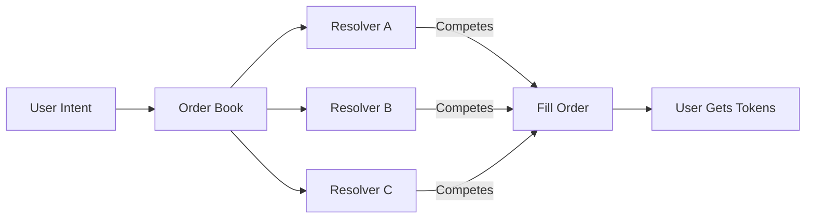
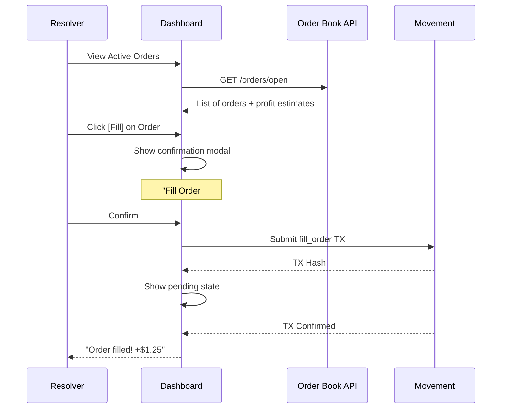
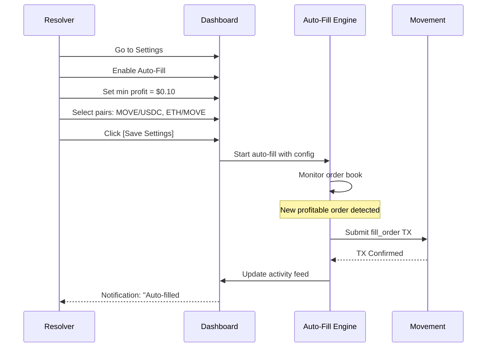
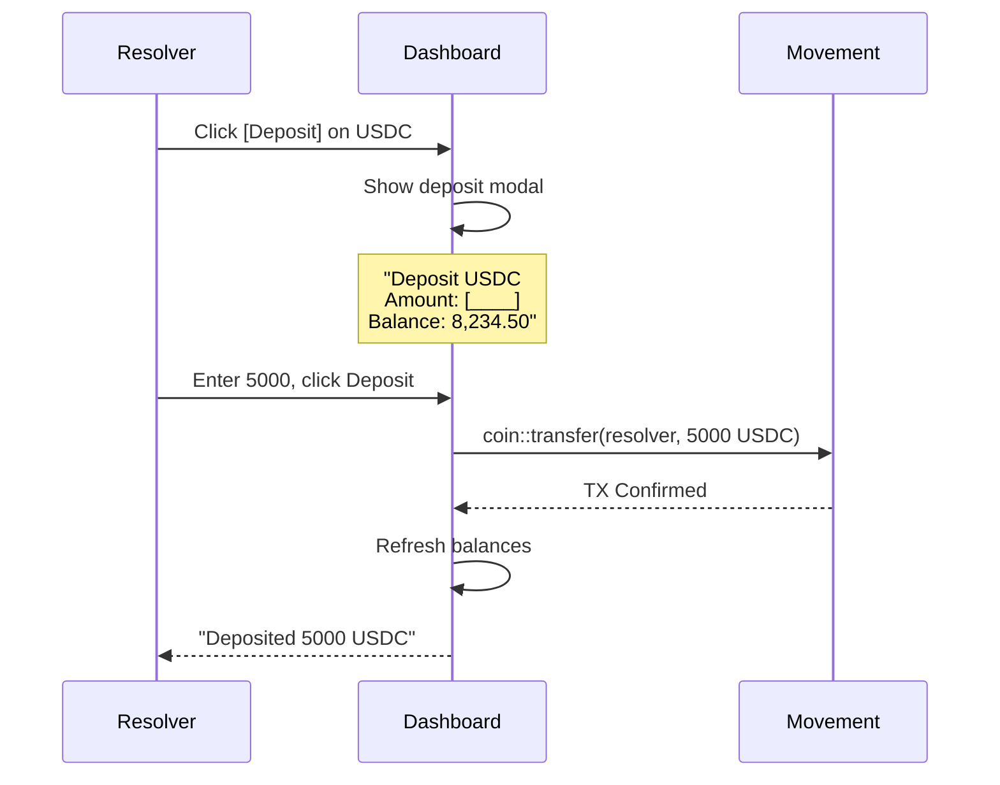

# Resolvers (Relayers) Guide

> Complete guide for running a resolver on Movement Intent Swap.

---

## What is a Resolver?

Resolvers are professional operators who:
- Monitor the order book for profitable intents
- Compete to fill user orders
- Pay gas fees on behalf of users
- Profit from the spread between user's minimum and actual fill price



---

## Resolver Requirements

### Minimum Requirements

| Requirement | Details |
|-------------|---------|
| **Capital** | 1,000+ USDC equivalent per token pair |
| **Infrastructure** | Server with <100ms latency to Movement RPC |
| **Uptime** | 99%+ recommended |
| **Technical** | TypeScript/Node.js or Python |

### Optional (Enhanced)

| Requirement | Benefit |
|-------------|---------|
| **Staking** | Priority in order book |
| **KYC/KYB** | Access to premium order flow |
| **Multi-chain** | More opportunities |

---

## Resolver Dashboard UI

### Main Dashboard

```
┌─────────────────────────────────────────────────────────────────────┐
│  RESOLVER DASHBOARD                              ⚡ Connected        │
├─────────────────────────────────────────────────────────────────────┤
│                                                                     │
│  ┌─────────────┐  ┌─────────────┐  ┌─────────────┐  ┌─────────────┐ │
│  │  24h Volume │  │  24h Fills  │  │  24h Profit │  │  Win Rate   │ │
│  │   $45,230   │  │     127     │  │   $234.50   │  │    78%      │ │
│  └─────────────┘  └─────────────┘  └─────────────┘  └─────────────┘ │
│                                                                     │
│  ACTIVE ORDERS                                        [Auto-Fill ON]│
│  ┌─────────────────────────────────────────────────────────────────┐│
│  │ ID    │ Pair      │ Size      │ Rate     │ Profit  │ Action    ││
│  ├───────┼───────────┼───────────┼──────────┼─────────┼───────────┤│
│  │ #4521 │ MOVE/USDC │ 500 MOVE  │ 0.847    │ +$1.25  │ [Fill]    ││
│  │ #4520 │ MOVE/USDC │ 100 MOVE  │ 0.842    │ +$0.31  │ [Fill]    ││
│  │ #4519 │ ETH/MOVE  │ 0.5 ETH   │ 2,450    │ +$2.10  │ [Fill]    ││
│  │ #4518 │ USDC/MOVE │ 1000 USDC │ 1.176    │ +$0.85  │ [Fill]    ││
│  └───────┴───────────┴───────────┴──────────┴─────────┴───────────┘│
│                                                                     │
│  RECENT ACTIVITY                                                    │
│  ┌─────────────────────────────────────────────────────────────────┐│
│  │ ✅ Filled #4517  MOVE/USDC  200 MOVE   +$0.65   2 min ago      ││
│  │ ✅ Filled #4516  MOVE/USDC  150 MOVE   +$0.42   5 min ago      ││
│  │ ❌ Failed #4515  MOVE/USDC  300 MOVE   Race lost  8 min ago    ││
│  │ ✅ Filled #4514  ETH/MOVE   1.2 ETH    +$4.20   12 min ago     ││
│  └─────────────────────────────────────────────────────────────────┘│
│                                                                     │
└─────────────────────────────────────────────────────────────────────┘
```

### Wallet & Balances

```
┌─────────────────────────────────────────────────────────────────────┐
│  WALLET MANAGEMENT                                                  │
├─────────────────────────────────────────────────────────────────────┤
│                                                                     │
│  Connected: 0x7a3b...4f2c                          [Disconnect]     │
│                                                                     │
│  TOKEN BALANCES                                                     │
│  ┌─────────────────────────────────────────────────────────────────┐│
│  │ Token    │ Balance        │ USD Value   │ Actions              ││
│  ├──────────┼────────────────┼─────────────┼──────────────────────┤│
│  │ MOVE     │ 12,450.00      │ $10,582     │ [Deposit] [Withdraw] ││
│  │ USDC     │ 8,234.50       │ $8,234      │ [Deposit] [Withdraw] ││
│  │ ETH      │ 2.45           │ $8,085      │ [Deposit] [Withdraw] ││
│  │ USDT     │ 5,000.00       │ $5,000      │ [Deposit] [Withdraw] ││
│  └──────────┴────────────────┴─────────────┴──────────────────────┘│
│                                                                     │
│  Total Portfolio Value: $31,901                                     │
│                                                                     │
└─────────────────────────────────────────────────────────────────────┘
```

### Settings & Configuration

```
┌─────────────────────────────────────────────────────────────────────┐
│  RESOLVER SETTINGS                                                  │
├─────────────────────────────────────────────────────────────────────┤
│                                                                     │
│  AUTO-FILL CONFIGURATION                                            │
│  ┌─────────────────────────────────────────────────────────────────┐│
│  │                                                                 ││
│  │  [✓] Enable Auto-Fill                                           ││
│  │                                                                 ││
│  │  Minimum Profit:        [$0.10      ▼]                          ││
│  │  Max Order Size:        [$10,000    ▼]                          ││
│  │  Gas Price Limit:       [Auto       ▼]                          ││
│  │                                                                 ││
│  │  SUPPORTED PAIRS                                                ││
│  │  [✓] MOVE/USDC    [✓] MOVE/USDT    [✓] ETH/MOVE                ││
│  │  [✓] USDC/MOVE    [ ] BTC/MOVE     [✓] ETH/USDC                ││
│  │                                                                 ││
│  └─────────────────────────────────────────────────────────────────┘│
│                                                                     │
│  PRICE SOURCES (Pyth Network)                                       │
│  ┌─────────────────────────────────────────────────────────────────┐│
│  │ ● Pyth: Connected (12ms latency)                                ││
│  │ ● DEX Backup: PontemSwap ✓                                      ││
│  │ ● Price Deviation Alert: 2%                                     ││
│  └─────────────────────────────────────────────────────────────────┘│
│                                                                     │
│  [Save Settings]                                                    │
│                                                                     │
└─────────────────────────────────────────────────────────────────────┘
```

### Analytics Page

```
┌─────────────────────────────────────────────────────────────────────┐
│  ANALYTICS                                     [7D] [30D] [ALL]     │
├─────────────────────────────────────────────────────────────────────┤
│                                                                     │
│  PROFIT CHART                                                       │
│  ┌─────────────────────────────────────────────────────────────────┐│
│  │     $50 ┤                                           ██          ││
│  │         │                              ██    ██    ██           ││
│  │     $30 ┤                    ██  ██   ██    ██    ██           ││
│  │         │              ██   ██  ██   ██    ██                   ││
│  │     $10 ┤   ██   ██   ██   ██                                   ││
│  │      $0 ┼─────────────────────────────────────────────────────  ││
│  │           Mon  Tue  Wed  Thu  Fri  Sat  Sun                     ││
│  └─────────────────────────────────────────────────────────────────┘│
│                                                                     │
│  PERFORMANCE METRICS                                                │
│  ┌─────────────┬─────────────┬─────────────┬─────────────┐         │
│  │ Total Fills │ Success Rate│ Avg Profit  │ Gas Spent   │         │
│  │    892      │    76.3%    │   $1.84     │   $45.20    │         │
│  └─────────────┴─────────────┴─────────────┴─────────────┘         │
│                                                                     │
│  TOP PAIRS BY VOLUME                                                │
│  ┌───────────────────────────────────────────────────────┐         │
│  │ MOVE/USDC  ████████████████████████   $125,430  (62%) │         │
│  │ ETH/MOVE   █████████████              $52,100   (26%) │         │
│  │ USDC/MOVE  ████████                   $24,500   (12%) │         │
│  └───────────────────────────────────────────────────────┘         │
│                                                                     │
└─────────────────────────────────────────────────────────────────────┘
```

---

## Resolver UI Flow

### Flow 1: Manual Fill



### Flow 2: Auto-Fill Setup



### Flow 3: Deposit Funds



---

## Pyth Integration

### Setup

```typescript
import { PriceServiceConnection } from '@pythnetwork/price-service-client';

const PYTH_ENDPOINT = 'https://hermes.pyth.network';
const connection = new PriceServiceConnection(PYTH_ENDPOINT);

// Price feed IDs for Movement tokens
const PRICE_FEEDS = {
  MOVE: '0x...move_usd_feed_id',
  ETH: '0xff61491a931112ddf1bd8147cd1b641375f79f5825126d665480874634fd0ace',
  USDC: '0xeaa020c61cc479712813461ce153894a96a6c00b21ed0cfc2798d1f9a9e9c94a',
};
```

### Get Real-Time Prices

```typescript
async function getPythPrices(): Promise<Map<string, number>> {
  const priceIds = Object.values(PRICE_FEEDS);
  const prices = await connection.getLatestPriceFeeds(priceIds);
  
  const priceMap = new Map<string, number>();
  
  for (const [token, feedId] of Object.entries(PRICE_FEEDS)) {
    const feed = prices.find(p => p.id === feedId);
    if (feed) {
      const price = feed.getPriceNoOlderThan(60); // Max 60s old
      if (price) {
        // Convert from Pyth format: price * 10^expo
        priceMap.set(token, price.price * Math.pow(10, price.expo));
      }
    }
  }
  
  return priceMap;
}
```

### Subscribe to Updates

```typescript
// Real-time price streaming for auto-fill
connection.subscribePriceFeedUpdates(
  Object.values(PRICE_FEEDS),
  (priceFeed) => {
    const price = priceFeed.getPriceNoOlderThan(60);
    if (price) {
      const token = getTokenByFeedId(priceFeed.id);
      updatePriceCache(token, price.price * Math.pow(10, price.expo));
      
      // Re-evaluate all pending orders with new price
      reevaluateOrderProfitability();
    }
  }
);
```

### Profitability Calculation with Pyth

```typescript
async function calculateProfit(intent: Intent): Promise<number> {
  const prices = await getPythPrices();
  
  const sellPrice = prices.get(intent.sellToken) || 0;
  const buyPrice = prices.get(intent.buyToken) || 0;
  
  // Value of tokens we receive
  const sellValueUsd = (Number(intent.sellAmount) / 1e8) * sellPrice;
  
  // Current Dutch auction requirement
  const requiredBuyAmount = calculateCurrentBuyAmount(intent);
  const buyCostUsd = (Number(requiredBuyAmount) / 1e6) * buyPrice;
  
  // Estimate gas cost
  const gasCostUsd = 0.01; // ~$0.01 on Movement
  
  // Net profit
  return sellValueUsd - buyCostUsd - gasCostUsd;
}
```

---

## Resolver Economics

### Revenue Model

```
Profit per Fill = Spread - Gas Cost

Where:
  Spread = Market Value of Sell Token - Buy Amount Paid
  Gas Cost ≈ $0.005 - $0.02 per fill
```

### Example Calculation

```
Order: 100 MOVE → USDC
  Market rate: 1 MOVE = $0.85
  Dutch auction requires: 84.50 USDC
  
  Value received: 100 MOVE × $0.85 = $85.00
  Cost paid: 84.50 USDC + $0.01 gas = $84.51
  
  Profit: $85.00 - $84.51 = $0.49
```

### Monthly Projections

| Fills/Day | Avg Profit | Monthly Profit | Monthly Gas |
|-----------|------------|----------------|-------------|
| 50        | $0.30      | $450           | $15         |
| 200       | $0.50      | $3,000         | $60         |
| 500       | $0.75      | $11,250        | $150        |

---

## Resolver React Components

### Order Card Component

```tsx
function OrderCard({ order, onFill }: OrderCardProps) {
  const { profit, isLoading } = useOrderProfitability(order);
  
  return (
    <Card className={profit > 0 ? 'border-green-500' : 'border-gray-300'}>
      <CardHeader>
        <div className="flex justify-between">
          <span>#{order.id}</span>
          <Badge>{order.intent.sellToken}/{order.intent.buyToken}</Badge>
        </div>
      </CardHeader>
      
      <CardContent>
        <div className="grid grid-cols-2 gap-4">
          <div>
            <p className="text-sm text-muted">Size</p>
            <p className="font-mono">{formatAmount(order.intent.sellAmount)}</p>
          </div>
          <div>
            <p className="text-sm text-muted">Required</p>
            <p className="font-mono">{formatAmount(order.currentBuyAmount)} USDC</p>
          </div>
        </div>
        
        <div className="mt-4 flex justify-between items-center">
          <span className={profit > 0 ? 'text-green-500' : 'text-red-500'}>
            {profit > 0 ? '+' : ''}{profit.toFixed(2)} USD
          </span>
          
          <Button 
            onClick={() => onFill(order)}
            disabled={profit <= 0 || isLoading}
          >
            Fill Order
          </Button>
        </div>
      </CardContent>
      
      <DutchAuctionProgress order={order} />
    </Card>
  );
}
```

### Auto-Fill Toggle

```tsx
function AutoFillToggle() {
  const [enabled, setEnabled] = useState(false);
  const [config, setConfig] = useState({
    minProfit: 0.10,
    maxOrderSize: 10000,
    pairs: ['MOVE/USDC', 'ETH/MOVE'],
  });
  
  const { startAutoFill, stopAutoFill, stats } = useAutoFill(config);
  
  const handleToggle = () => {
    if (enabled) {
      stopAutoFill();
    } else {
      startAutoFill();
    }
    setEnabled(!enabled);
  };
  
  return (
    <div className="flex items-center gap-4">
      <Switch checked={enabled} onCheckedChange={handleToggle} />
      <span>Auto-Fill {enabled ? 'ON' : 'OFF'}</span>
      
      {enabled && (
        <div className="text-sm text-muted">
          {stats.fillsThisSession} fills | +${stats.profitThisSession.toFixed(2)}
        </div>
      )}
    </div>
  );
}
```

### Profit Chart

```tsx
function ProfitChart({ data }: { data: ProfitDataPoint[] }) {
  return (
    <ResponsiveContainer width="100%" height={300}>
      <AreaChart data={data}>
        <defs>
          <linearGradient id="profitGradient" x1="0" y1="0" x2="0" y2="1">
            <stop offset="5%" stopColor="#22c55e" stopOpacity={0.8}/>
            <stop offset="95%" stopColor="#22c55e" stopOpacity={0}/>
          </linearGradient>
        </defs>
        
        <XAxis dataKey="date" />
        <YAxis />
        <Tooltip formatter={(value) => [`$${value}`, 'Profit']} />
        
        <Area 
          type="monotone" 
          dataKey="profit" 
          stroke="#22c55e" 
          fill="url(#profitGradient)" 
        />
      </AreaChart>
    </ResponsiveContainer>
  );
}
```

---

## API Endpoints for Resolver

```typescript
// Order Book API
GET  /orders/open                    // List open orders
GET  /orders/:id                     // Order details
POST /orders/:id/reserve             // Temporarily reserve order (optional)
GET  /orders/stats                   // Market statistics

// Resolver API
POST /resolver/register              // Register as resolver
GET  /resolver/profile               // Get resolver stats
GET  /resolver/fills                 // Fill history
GET  /resolver/analytics             // Detailed analytics
```

---

## Getting Started Checklist

- [ ] Set up server with Movement RPC access
- [ ] Create resolver wallet and fund with MOVE (for gas)
- [ ] Fund wallet with tokens for supported pairs
- [ ] Configure Pyth price feed connection
- [ ] Register with order book API
- [ ] Test manual fill on testnet
- [ ] Configure auto-fill settings
- [ ] Enable auto-fill in production
- [ ] Monitor analytics dashboard

---

*Resolver guide for Movement Intent Swap*
