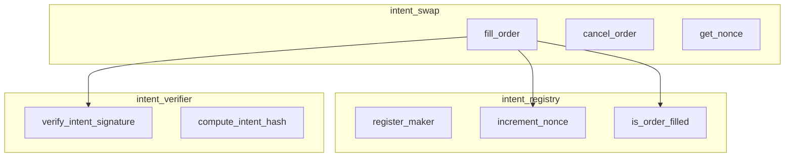

# Movement Intent Swap - Smart Contracts

> Move module specifications for intent-based swapping on Movement Network.

---

## Module Overview



---

## Data Structures

### Intent Structure

```move
module intent_swap::types {
    use std::string::String;
    
    /// Represents a signed swap intent from a user
    struct Intent has copy, drop, store {
        /// User's address
        maker: address,
        /// Unique nonce to prevent replay
        nonce: u64,
        /// Token the user is selling
        sell_token: address,
        /// Token the user wants to receive
        buy_token: address,
        /// Amount of sell_token to swap
        sell_amount: u64,
        /// Starting ask amount (Dutch auction start)
        start_buy_amount: u64,
        /// Minimum acceptable amount (Dutch auction end)
        end_buy_amount: u64,
        /// Auction start timestamp (seconds)
        start_time: u64,
        /// Auction end timestamp (seconds)
        end_time: u64,
    }
    
    /// Event emitted when an order is filled
    struct OrderFilled has drop, store {
        maker: address,
        relayer: address,
        sell_token: address,
        buy_token: address,
        sell_amount: u64,
        buy_amount: u64,
        nonce: u64,
        timestamp: u64,
    }
    
    /// Event emitted when an order is cancelled
    struct OrderCancelled has drop, store {
        maker: address,
        nonce: u64,
        timestamp: u64,
    }
}
```

### Registry State

```move
module intent_swap::registry {
    use aptos_framework::table::{Self, Table};
    
    /// Global registry for tracking nonces and filled orders
    struct Registry has key {
        /// Current nonce for each maker
        nonces: Table<address, u64>,
        /// Filled order hashes (prevents double-fill)
        filled_orders: Table<vector<u8>, bool>,
    }
    
    /// Initialize registry (called once at deployment)
    public entry fun initialize(admin: &signer) {
        move_to(admin, Registry {
            nonces: table::new(),
            filled_orders: table::new(),
        });
    }
    
    /// Get current nonce for a maker
    public fun get_nonce(maker: address): u64 acquires Registry {
        let registry = borrow_global<Registry>(@intent_swap);
        if (table::contains(&registry.nonces, maker)) {
            *table::borrow(&registry.nonces, maker)
        } else {
            0
        }
    }
    
    /// Increment nonce after successful fill
    public(friend) fun increment_nonce(maker: address) acquires Registry {
        let registry = borrow_global_mut<Registry>(@intent_swap);
        if (table::contains(&registry.nonces, maker)) {
            let nonce = table::borrow_mut(&registry.nonces, maker);
            *nonce = *nonce + 1;
        } else {
            table::add(&mut registry.nonces, maker, 1);
        };
    }
    
    /// Mark order as filled
    public(friend) fun mark_filled(order_hash: vector<u8>) acquires Registry {
        let registry = borrow_global_mut<Registry>(@intent_swap);
        table::add(&mut registry.filled_orders, order_hash, true);
    }
    
    /// Check if order already filled
    public fun is_filled(order_hash: vector<u8>): bool acquires Registry {
        let registry = borrow_global<Registry>(@intent_swap);
        table::contains(&registry.filled_orders, order_hash)
    }
}
```

---

## Core Module: Intent Swap

```move
module intent_swap::swap {
    use std::signer;
    use std::vector;
    use aptos_framework::coin::{Self, Coin};
    use aptos_framework::timestamp;
    use aptos_framework::event;
    use aptos_std::ed25519;
    
    use intent_swap::types::{Intent, OrderFilled, OrderCancelled};
    use intent_swap::registry::{Self, get_nonce, increment_nonce, mark_filled, is_filled};
    use intent_swap::verifier::{verify_intent_signature, compute_intent_hash};
    
    /// Errors
    const E_INVALID_SIGNATURE: u64 = 1;
    const E_ORDER_EXPIRED: u64 = 2;
    const E_ORDER_NOT_STARTED: u64 = 3;
    const E_INSUFFICIENT_BUY_AMOUNT: u64 = 4;
    const E_INVALID_NONCE: u64 = 5;
    const E_ORDER_ALREADY_FILLED: u64 = 6;
    const E_INVALID_AMOUNTS: u64 = 7;
    
    /// Event handle for order fills
    struct SwapEvents has key {
        order_filled_events: event::EventHandle<OrderFilled>,
        order_cancelled_events: event::EventHandle<OrderCancelled>,
    }
    
    /// Initialize event handles
    public entry fun initialize(admin: &signer) {
        move_to(admin, SwapEvents {
            order_filled_events: event::new_event_handle<OrderFilled>(admin),
            order_cancelled_events: event::new_event_handle<OrderCancelled>(admin),
        });
    }
    
    /// Fill an intent order
    /// Called by relayer, who provides the buy tokens to the maker
    public entry fun fill_order<SellCoin, BuyCoin>(
        relayer: &signer,
        // Intent fields (reconstructed from off-chain)
        maker: address,
        nonce: u64,
        sell_amount: u64,
        start_buy_amount: u64,
        end_buy_amount: u64,
        start_time: u64,
        end_time: u64,
        // Relayer's offer
        buy_amount: u64,
        // Maker's signature
        signature: vector<u8>,
    ) acquires SwapEvents {
        let now = timestamp::now_seconds();
        
        // 1. Validate timing
        assert!(now >= start_time, E_ORDER_NOT_STARTED);
        assert!(now <= end_time, E_ORDER_EXPIRED);
        
        // 2. Validate amounts
        assert!(start_buy_amount >= end_buy_amount, E_INVALID_AMOUNTS);
        
        // 3. Calculate required buy amount (Dutch auction)
        let required_buy_amount = calculate_buy_amount(
            start_buy_amount,
            end_buy_amount,
            start_time,
            end_time,
            now
        );
        
        // 4. Check relayer's offer meets requirement
        assert!(buy_amount >= required_buy_amount, E_INSUFFICIENT_BUY_AMOUNT);
        
        // 5. Reconstruct intent for signature verification
        let intent = Intent {
            maker,
            nonce,
            sell_token: type_info::type_of<SellCoin>().account_address,
            buy_token: type_info::type_of<BuyCoin>().account_address,
            sell_amount,
            start_buy_amount,
            end_buy_amount,
            start_time,
            end_time,
        };
        
        // 6. Compute order hash
        let order_hash = compute_intent_hash(&intent);
        
        // 7. Check not already filled
        assert!(!is_filled(order_hash), E_ORDER_ALREADY_FILLED);
        
        // 8. Validate nonce
        let current_nonce = get_nonce(maker);
        assert!(nonce == current_nonce, E_INVALID_NONCE);
        
        // 9. Verify signature
        assert!(
            verify_intent_signature(&intent, &signature, maker),
            E_INVALID_SIGNATURE
        );
        
        // 10. Execute swap
        // Relayer sends buy tokens to maker
        let buy_coins = coin::withdraw<BuyCoin>(relayer, buy_amount);
        coin::deposit(maker, buy_coins);
        
        // Maker's sell tokens go to relayer (requires prior approval)
        let sell_coins = coin::withdraw<SellCoin>(
            &create_signer_for_maker(maker), // See note below
            sell_amount
        );
        coin::deposit(signer::address_of(relayer), sell_coins);
        
        // 11. Mark order as filled
        mark_filled(order_hash);
        increment_nonce(maker);
        
        // 12. Emit event
        let events = borrow_global_mut<SwapEvents>(@intent_swap);
        event::emit_event(&mut events.order_filled_events, OrderFilled {
            maker,
            relayer: signer::address_of(relayer),
            sell_token: type_info::type_of<SellCoin>().account_address,
            buy_token: type_info::type_of<BuyCoin>().account_address,
            sell_amount,
            buy_amount,
            nonce,
            timestamp: now,
        });
    }
    
    /// Calculate current buy amount based on Dutch auction
    fun calculate_buy_amount(
        start_amount: u64,
        end_amount: u64,
        start_time: u64,
        end_time: u64,
        current_time: u64,
    ): u64 {
        if (current_time >= end_time) {
            return end_amount
        };
        
        let elapsed = current_time - start_time;
        let duration = end_time - start_time;
        let price_drop = start_amount - end_amount;
        
        // Linear interpolation
        start_amount - (price_drop * elapsed / duration)
    }
    
    /// Cancel order by incrementing nonce
    public entry fun cancel_order(maker: &signer) acquires SwapEvents {
        let maker_addr = signer::address_of(maker);
        increment_nonce(maker_addr);
        
        let events = borrow_global_mut<SwapEvents>(@intent_swap);
        event::emit_event(&mut events.order_cancelled_events, OrderCancelled {
            maker: maker_addr,
            nonce: get_nonce(maker_addr) - 1,
            timestamp: timestamp::now_seconds(),
        });
    }
}
```

---

## Signature Verification

```move
module intent_swap::verifier {
    use std::bcs;
    use std::hash;
    use aptos_std::ed25519;
    use intent_swap::types::Intent;
    
    /// Domain separator for intent signing
    const DOMAIN_SEPARATOR: vector<u8> = b"MOVE_INTENT_SWAP_V1";
    
    /// Compute hash of intent for signing/verification
    public fun compute_intent_hash(intent: &Intent): vector<u8> {
        let data = vector::empty<u8>();
        
        // Append domain separator
        vector::append(&mut data, DOMAIN_SEPARATOR);
        
        // Serialize intent fields
        vector::append(&mut data, bcs::to_bytes(&intent.maker));
        vector::append(&mut data, bcs::to_bytes(&intent.nonce));
        vector::append(&mut data, bcs::to_bytes(&intent.sell_token));
        vector::append(&mut data, bcs::to_bytes(&intent.buy_token));
        vector::append(&mut data, bcs::to_bytes(&intent.sell_amount));
        vector::append(&mut data, bcs::to_bytes(&intent.start_buy_amount));
        vector::append(&mut data, bcs::to_bytes(&intent.end_buy_amount));
        vector::append(&mut data, bcs::to_bytes(&intent.start_time));
        vector::append(&mut data, bcs::to_bytes(&intent.end_time));
        
        // Hash the serialized data
        hash::sha3_256(data)
    }
    
    /// Verify maker's signature over intent
    public fun verify_intent_signature(
        intent: &Intent,
        signature: &vector<u8>,
        maker: address,
    ): bool {
        let message_hash = compute_intent_hash(intent);
        
        // Verify using ed25519
        let sig = ed25519::new_signature_from_bytes(*signature);
        let pk = account::get_authentication_key(maker);
        
        ed25519::signature_verify_strict(
            &sig,
            &ed25519::new_unvalidated_public_key_from_bytes(pk),
            message_hash,
        )
    }
}
```

---

## Token Approval Pattern

Since Move doesn't have ERC20-style approvals, we need an escrow pattern:

```move
module intent_swap::escrow {
    use aptos_framework::coin::{Self, Coin};
    use aptos_framework::table::{Self, Table};
    
    /// User's escrowed tokens for intent swaps
    struct UserEscrow<phantom CoinType> has key {
        balance: Coin<CoinType>,
    }
    
    /// Deposit tokens for potential swaps
    public entry fun deposit<CoinType>(
        user: &signer,
        amount: u64,
    ) {
        let user_addr = signer::address_of(user);
        let coins = coin::withdraw<CoinType>(user, amount);
        
        if (exists<UserEscrow<CoinType>>(user_addr)) {
            let escrow = borrow_global_mut<UserEscrow<CoinType>>(user_addr);
            coin::merge(&mut escrow.balance, coins);
        } else {
            move_to(user, UserEscrow<CoinType> { balance: coins });
        }
    }
    
    /// Withdraw unused tokens
    public entry fun withdraw<CoinType>(
        user: &signer,
        amount: u64,
    ) acquires UserEscrow {
        let user_addr = signer::address_of(user);
        let escrow = borrow_global_mut<UserEscrow<CoinType>>(user_addr);
        let coins = coin::extract(&mut escrow.balance, amount);
        coin::deposit(user_addr, coins);
    }
    
    /// Internal: Transfer from escrow (called by swap module)
    public(friend) fun transfer_from_escrow<CoinType>(
        maker: address,
        to: address,
        amount: u64,
    ) acquires UserEscrow {
        let escrow = borrow_global_mut<UserEscrow<CoinType>>(maker);
        let coins = coin::extract(&mut escrow.balance, amount);
        coin::deposit(to, coins);
    }
    
    /// Get escrowed balance
    public fun get_balance<CoinType>(user: address): u64 acquires UserEscrow {
        if (exists<UserEscrow<CoinType>>(user)) {
            coin::value(&borrow_global<UserEscrow<CoinType>>(user).balance)
        } else {
            0
        }
    }
}
```

---

## View Functions

```move
module intent_swap::views {
    use intent_swap::registry;
    use intent_swap::escrow;
    use intent_swap::swap;
    
    #[view]
    /// Get user's current nonce
    public fun get_user_nonce(user: address): u64 {
        registry::get_nonce(user)
    }
    
    #[view]
    /// Get user's escrowed balance for a token
    public fun get_escrowed_balance<CoinType>(user: address): u64 {
        escrow::get_balance<CoinType>(user)
    }
    
    #[view]
    /// Check if order hash has been filled
    public fun is_order_filled(order_hash: vector<u8>): bool {
        registry::is_filled(order_hash)
    }
    
    #[view]
    /// Calculate current Dutch auction price
    public fun get_current_price(
        start_amount: u64,
        end_amount: u64,
        start_time: u64,
        end_time: u64,
    ): u64 {
        swap::calculate_buy_amount(
            start_amount,
            end_amount,
            start_time,
            end_time,
            timestamp::now_seconds(),
        )
    }
}
```

---

## Deployment Checklist

- [ ] Deploy `intent_swap::types`
- [ ] Deploy `intent_swap::registry` → Call `initialize()`
- [ ] Deploy `intent_swap::verifier`
- [ ] Deploy `intent_swap::escrow`
- [ ] Deploy `intent_swap::swap` → Call `initialize()`
- [ ] Deploy `intent_swap::views`
- [ ] Test with sample intent on testnet
- [ ] Verify signature encoding matches frontend

---

## Next Steps

→ [RELAYER_DESIGN.md](./RELAYER_DESIGN.md) - Off-chain relayer implementation
