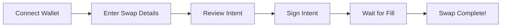

# Movement Intent Swap - User Flow

> Frontend integration guide for gasless intent-based swapping.

---

## User Journey



---

## Step 1: Connect Wallet

```tsx
import { useWallet } from '@aptos-labs/wallet-adapter-react';

function ConnectButton() {
  const { connect, account, connected } = useWallet();
  
  if (connected) {
    return <div>Connected: {account?.address}</div>;
  }
  
  return <button onClick={() => connect()}>Connect Wallet</button>;
}
```

---

## Step 2: Swap Form

```tsx
interface SwapFormData {
  sellToken: string;
  buyToken: string;
  sellAmount: string;
  slippageTolerance: number; // e.g., 0.5%
}

function SwapForm() {
  const [form, setForm] = useState<SwapFormData>({
    sellToken: 'MOVE',
    buyToken: 'USDC',
    sellAmount: '',
    slippageTolerance: 0.5,
  });
  
  const { data: quote } = useSwapQuote(form);
  
  return (
    <div className="swap-card">
      <TokenInput
        label="You Pay"
        token={form.sellToken}
        amount={form.sellAmount}
        onChange={(amount) => setForm({ ...form, sellAmount: amount })}
      />
      
      <SwapArrow />
      
      <TokenInput
        label="You Receive"
        token={form.buyToken}
        amount={quote?.estimatedOutput || '0'}
        readonly
      />
      
      <SwapDetails
        rate={quote?.rate}
        slippage={form.slippageTolerance}
        networkFee="Free (covered by relayer)"
      />
      
      <SwapButton form={form} quote={quote} />
    </div>
  );
}
```

---

## Step 3: Build Intent

```tsx
import { useWallet } from '@aptos-labs/wallet-adapter-react';

interface IntentBuilder {
  buildIntent(params: SwapParams): Promise<Intent>;
  signIntent(intent: Intent): Promise<SignedIntent>;
}

function useIntentBuilder(): IntentBuilder {
  const { account, signMessage } = useWallet();
  
  const buildIntent = async (params: SwapParams): Promise<Intent> => {
    // Fetch current nonce from contract
    const nonce = await getNonce(account!.address);
    
    // Calculate Dutch auction parameters
    const now = Math.floor(Date.now() / 1000);
    const duration = 300; // 5 minutes
    
    const marketRate = await getMarketRate(params.sellToken, params.buyToken);
    const sellAmountBigInt = BigInt(parseFloat(params.sellAmount) * 1e8);
    
    // Start at market rate, end at slippage-adjusted rate
    const startBuyAmount = (sellAmountBigInt * marketRate) / BigInt(1e8);
    const endBuyAmount = startBuyAmount * BigInt(100 - params.slippageTolerance * 100) / 100n;
    
    return {
      maker: account!.address,
      nonce,
      sellToken: getTokenAddress(params.sellToken),
      buyToken: getTokenAddress(params.buyToken),
      sellAmount: sellAmountBigInt,
      startBuyAmount,
      endBuyAmount,
      startTime: BigInt(now),
      endTime: BigInt(now + duration),
    };
  };
  
  const signIntent = async (intent: Intent): Promise<SignedIntent> => {
    const hash = computeIntentHash(intent);
    
    // Sign the intent hash
    const signature = await signMessage({
      message: hash,
      nonce: intent.nonce.toString(),
    });
    
    return {
      ...intent,
      signature: signature.signature,
    };
  };
  
  return { buildIntent, signIntent };
}
```

---

## Step 4: Sign & Submit

```tsx
function SwapButton({ form, quote }: SwapButtonProps) {
  const { buildIntent, signIntent } = useIntentBuilder();
  const [status, setStatus] = useState<'idle' | 'signing' | 'submitting' | 'pending'>('idle');
  
  const handleSwap = async () => {
    try {
      // Build intent
      setStatus('signing');
      const intent = await buildIntent({
        sellToken: form.sellToken,
        buyToken: form.buyToken,
        sellAmount: form.sellAmount,
        slippageTolerance: form.slippageTolerance,
      });
      
      // Sign intent (user sees wallet popup)
      const signedIntent = await signIntent(intent);
      
      // Submit to order book
      setStatus('submitting');
      const order = await submitOrder(signedIntent);
      
      // Wait for fill
      setStatus('pending');
      await waitForFill(order.id);
      
      // Success!
      toast.success('Swap complete!');
    } catch (error) {
      toast.error('Swap failed: ' + error.message);
    } finally {
      setStatus('idle');
    }
  };
  
  return (
    <button 
      onClick={handleSwap}
      disabled={status !== 'idle'}
      className="swap-button"
    >
      {status === 'idle' && 'Swap (Gasless)'}
      {status === 'signing' && 'Sign in wallet...'}
      {status === 'submitting' && 'Submitting order...'}
      {status === 'pending' && 'Waiting for fill...'}
    </button>
  );
}
```

---

## Step 5: Order Tracking

```tsx
function OrderTracker({ orderId }: { orderId: string }) {
  const { data: order, isLoading } = useOrderStatus(orderId);
  
  if (isLoading) return <Spinner />;
  
  return (
    <div className="order-tracker">
      <StatusBadge status={order.status} />
      
      {order.status === 'open' && (
        <DutchAuctionProgress
          startTime={order.intent.startTime}
          endTime={order.intent.endTime}
          startAmount={order.intent.startBuyAmount}
          endAmount={order.intent.endBuyAmount}
        />
      )}
      
      {order.status === 'filled' && (
        <FillDetails
          txHash={order.fillTx}
          actualAmount={order.fillAmount}
          relayer={order.filledBy}
        />
      )}
      
      {order.status === 'expired' && (
        <div className="text-muted">
          Order expired. No relayer filled within time window.
        </div>
      )}
    </div>
  );
}
```

---

## Dutch Auction Visualization

```tsx
function DutchAuctionProgress({ startTime, endTime, startAmount, endAmount }: Props) {
  const [currentAmount, setCurrentAmount] = useState(startAmount);
  const [progress, setProgress] = useState(0);
  
  useEffect(() => {
    const interval = setInterval(() => {
      const now = Math.floor(Date.now() / 1000);
      const elapsed = now - Number(startTime);
      const duration = Number(endTime) - Number(startTime);
      
      const prog = Math.min(elapsed / duration, 1);
      setProgress(prog * 100);
      
      const current = startAmount - (startAmount - endAmount) * BigInt(Math.floor(prog * 100)) / 100n;
      setCurrentAmount(current);
    }, 1000);
    
    return () => clearInterval(interval);
  }, [startTime, endTime, startAmount, endAmount]);
  
  return (
    <div className="auction-progress">
      <div className="amount-display">
        Current Rate: {formatAmount(currentAmount)}
      </div>
      
      <div className="progress-bar">
        <div className="progress-fill" style={{ width: `${progress}%` }} />
      </div>
      
      <div className="time-remaining">
        {formatTimeRemaining(Number(endTime) - Math.floor(Date.now() / 1000))}
      </div>
    </div>
  );
}
```

---

## API Integration

```tsx
// hooks/useOrderBook.ts

const ORDER_BOOK_URL = process.env.NEXT_PUBLIC_ORDER_BOOK_URL;

export async function submitOrder(signedIntent: SignedIntent): Promise<Order> {
  const response = await fetch(`${ORDER_BOOK_URL}/orders`, {
    method: 'POST',
    headers: { 'Content-Type': 'application/json' },
    body: JSON.stringify(signedIntent),
  });
  
  if (!response.ok) {
    throw new Error('Failed to submit order');
  }
  
  return response.json();
}

export function useOrderStatus(orderId: string) {
  return useQuery({
    queryKey: ['order', orderId],
    queryFn: async () => {
      const response = await fetch(`${ORDER_BOOK_URL}/orders/${orderId}`);
      return response.json();
    },
    refetchInterval: 2000, // Poll every 2 seconds
  });
}

export async function waitForFill(orderId: string): Promise<Order> {
  return new Promise((resolve, reject) => {
    const poll = setInterval(async () => {
      const response = await fetch(`${ORDER_BOOK_URL}/orders/${orderId}`);
      const order = await response.json();
      
      if (order.status === 'filled') {
        clearInterval(poll);
        resolve(order);
      } else if (order.status === 'expired' || order.status === 'cancelled') {
        clearInterval(poll);
        reject(new Error(`Order ${order.status}`));
      }
    }, 2000);
    
    // Timeout after 10 minutes
    setTimeout(() => {
      clearInterval(poll);
      reject(new Error('Order timeout'));
    }, 600000);
  });
}
```

---

## Escrow (Pre-Deposit Flow)

For the escrow pattern, users must first deposit tokens:

```tsx
function EscrowManager() {
  const { account, signAndSubmitTransaction } = useWallet();
  const { data: balance } = useEscrowBalance(account?.address);
  
  const deposit = async (amount: string) => {
    await signAndSubmitTransaction({
      data: {
        function: `${INTENT_SWAP_ADDRESS}::escrow::deposit`,
        typeArguments: ['0x1::aptos_coin::AptosCoin'],
        functionArguments: [parseAmount(amount)],
      },
    });
  };
  
  const withdraw = async (amount: string) => {
    await signAndSubmitTransaction({
      data: {
        function: `${INTENT_SWAP_ADDRESS}::escrow::withdraw`,
        typeArguments: ['0x1::aptos_coin::AptosCoin'],
        functionArguments: [parseAmount(amount)],
      },
    });
  };
  
  return (
    <div className="escrow-manager">
      <h3>Swap Balance</h3>
      <p>Available: {formatAmount(balance)} MOVE</p>
      
      <div className="actions">
        <DepositModal onDeposit={deposit} />
        <WithdrawModal onWithdraw={withdraw} maxAmount={balance} />
      </div>
      
      <p className="hint">
        Deposit tokens to enable gasless swaps. Withdraw anytime.
      </p>
    </div>
  );
}
```

---

## Complete UI Component

```tsx
export function IntentSwapPage() {
  const { connected } = useWallet();
  const [activeOrder, setActiveOrder] = useState<string | null>(null);
  
  if (!connected) {
    return (
      <div className="swap-page">
        <ConnectPrompt />
      </div>
    );
  }
  
  return (
    <div className="swap-page">
      <Card>
        <CardHeader>
          <CardTitle>Swap (Gasless)</CardTitle>
          <CardDescription>
            Sign an intent, relayers compete to fill your order
          </CardDescription>
        </CardHeader>
        
        <CardContent>
          {!activeOrder ? (
            <SwapForm onOrderCreated={setActiveOrder} />
          ) : (
            <OrderTracker 
              orderId={activeOrder} 
              onComplete={() => setActiveOrder(null)}
            />
          )}
        </CardContent>
        
        <CardFooter>
          <EscrowManager />
        </CardFooter>
      </Card>
    </div>
  );
}
```

---

## Error Handling

| Error | User Message | Recovery |
|-------|--------------|----------|
| Wallet disconnected | "Please connect wallet" | Reconnect |
| Insufficient escrow | "Deposit more tokens" | Show deposit modal |
| Sign rejected | "Signature cancelled" | Allow retry |
| Order expired | "No relayer filled in time" | Create new order |
| Network error | "Connection issue, retrying..." | Auto-retry |

---

## UX Best Practices

1. **Show "Gasless" prominently** - Key differentiator
2. **Display Dutch auction visually** - Build trust with transparency
3. **Real-time updates** - Poll frequently (2s intervals)
4. **Explain escrow simply** - "Like depositing to a savings account"
5. **Show relayer competition** - "3 relayers competing for your order"

---

*User flow documentation for Movement Intent Swap*
