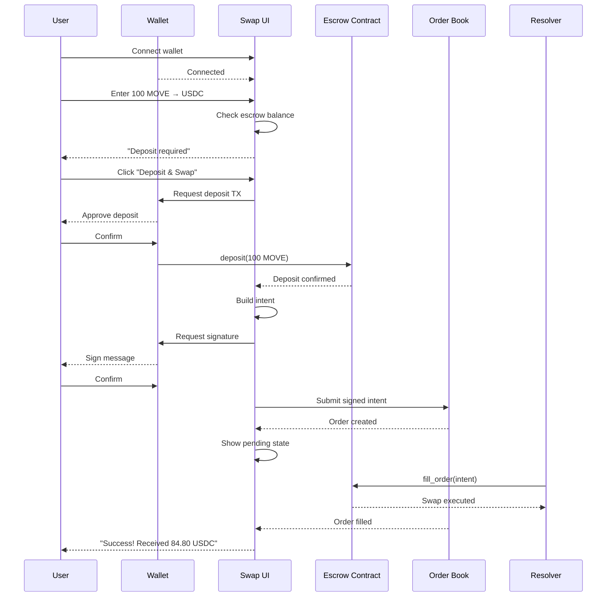
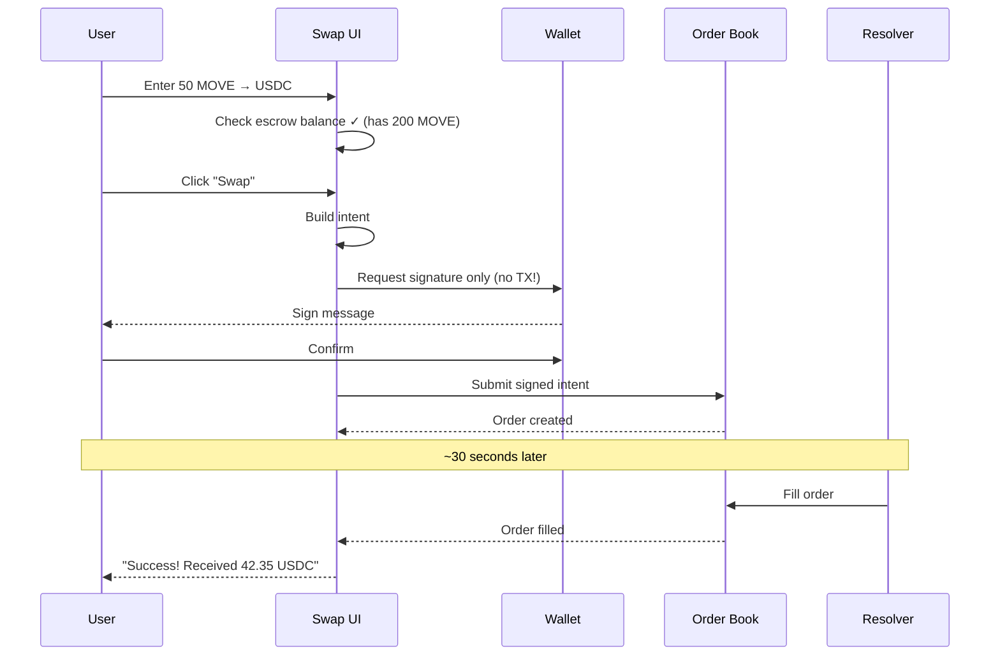
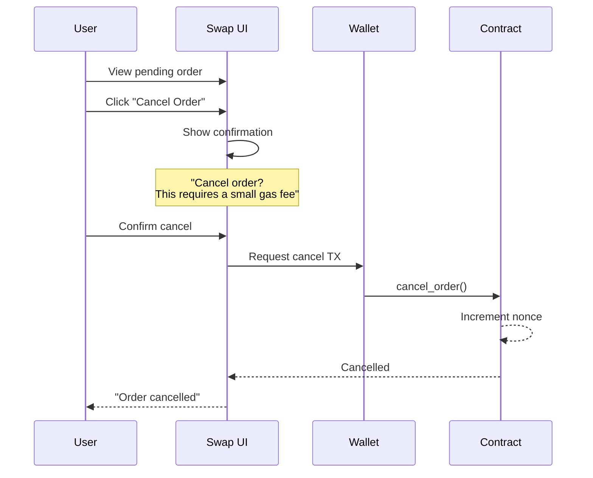

# User Guide - Movement Intent Swap

> Complete guide for users performing gasless swaps on Movement Network.

---

## Why Use Intent Swap?

| Feature | Traditional DEX | Intent Swap |
|---------|-----------------|-------------|
| **Gas Fees** | You pay | FREE ✨ |
| **Price** | Fixed at moment | Best rate via competition |
| **MEV Risk** | High (sandwich attacks) | Protected |
| **Complexity** | Multiple clicks | Sign once |

---

## Getting Started

### Requirements

- Movement-compatible wallet (Petra, Martian, Pontem)
- Tokens to swap (MOVE, USDC, ETH, etc.)
- No gas needed for swaps! (only for deposits/withdrawals)

---

## User Interface

### Main Swap Page

```
┌─────────────────────────────────────────────────────────────────────┐
│  🔄 INTENT SWAP                                   [Connect Wallet]  │
├─────────────────────────────────────────────────────────────────────┤
│                                                                     │
│  ┌─────────────────────────────────────────────────────────────────┐│
│  │  You Pay                                                        ││
│  │  ┌─────────────────────────────────────────────────────────────┐││
│  │  │  [MOVE ▼]                                    100           │││
│  │  │  Balance: 1,234.50 MOVE                      [MAX]         │││
│  │  └─────────────────────────────────────────────────────────────┘││
│  └─────────────────────────────────────────────────────────────────┘│
│                                                                     │
│                              [↕️]                                    │
│                                                                     │
│  ┌─────────────────────────────────────────────────────────────────┐│
│  │  You Receive                                                    ││
│  │  ┌─────────────────────────────────────────────────────────────┐││
│  │  │  [USDC ▼]                                    ~85.00        │││
│  │  │  1 MOVE = 0.85 USDC                                        │││
│  │  └─────────────────────────────────────────────────────────────┘││
│  └─────────────────────────────────────────────────────────────────┘│
│                                                                     │
│  ┌─────────────────────────────────────────────────────────────────┐│
│  │  Slippage Tolerance:  [0.5%]  [1%]  [Custom: ___]              ││
│  │  Minimum Received:    84.58 USDC                                ││
│  │  Network Fee:         FREE ✨                                   ││
│  │  Time Window:         5 minutes                                 ││
│  └─────────────────────────────────────────────────────────────────┘│
│                                                                     │
│  ┌─────────────────────────────────────────────────────────────────┐│
│  │                    [Swap - Gasless ⚡]                          ││
│  └─────────────────────────────────────────────────────────────────┘│
│                                                                     │
└─────────────────────────────────────────────────────────────────────┘
```

### Token Selection Modal

```
┌─────────────────────────────────────────────────────────────────────┐
│  Select Token                                              [✕]      │
├─────────────────────────────────────────────────────────────────────┤
│                                                                     │
│  [🔍 Search by name or address...                              ]   │
│                                                                     │
│  YOUR TOKENS                                                        │
│  ┌─────────────────────────────────────────────────────────────────┐│
│  │ 🟣 MOVE      Movement      1,234.50         $1,049.32          ││
│  │ 💵 USDC      USD Coin         500.00           $500.00          ││
│  │ ⟠  ETH       Ethereum           1.25         $4,125.00          ││
│  └─────────────────────────────────────────────────────────────────┘│
│                                                                     │
│  POPULAR TOKENS                                                     │
│  ┌─────────────────────────────────────────────────────────────────┐│
│  │ 💵 USDT      Tether USD                                        ││
│  │ 🟡 WBTC      Wrapped Bitcoin                                   ││
│  │ 🔷 DAI       Dai Stablecoin                                    ││
│  └─────────────────────────────────────────────────────────────────┘│
│                                                                     │
└─────────────────────────────────────────────────────────────────────┘
```

### Swap Confirmation Modal

```
┌─────────────────────────────────────────────────────────────────────┐
│  Confirm Swap                                              [✕]      │
├─────────────────────────────────────────────────────────────────────┤
│                                                                     │
│                        🔄                                           │
│                                                                     │
│              100 MOVE  →  ~85 USDC                                  │
│                                                                     │
│  ─────────────────────────────────────────────────────────────────  │
│                                                                     │
│  Rate                           1 MOVE = 0.85 USDC                  │
│  Minimum Received               84.58 USDC                          │
│  Slippage Tolerance             0.5%                                │
│  Network Fee                    FREE ✨                             │
│  Order Expires In               5 minutes                           │
│                                                                     │
│  ─────────────────────────────────────────────────────────────────  │
│                                                                     │
│  ⓘ You will sign a message authorizing this swap.                  │
│    No transaction fee required!                                     │
│                                                                     │
│  ┌─────────────────────────────────────────────────────────────────┐│
│  │                    [Sign & Submit]                              ││
│  └─────────────────────────────────────────────────────────────────┘│
│                                                                     │
└─────────────────────────────────────────────────────────────────────┘
```

### Pending Order View

```
┌─────────────────────────────────────────────────────────────────────┐
│  Order Pending                                             [✕]      │
├─────────────────────────────────────────────────────────────────────┤
│                                                                     │
│                      ⏳ Waiting for fill...                         │
│                                                                     │
│              100 MOVE  →  USDC                                      │
│                                                                     │
│  ─────────────────────────────────────────────────────────────────  │
│                                                                     │
│  DUTCH AUCTION PROGRESS                                             │
│                                                                     │
│  Current Rate:    85.00 USDC   ████████████░░░░░░   2:30 left       │
│  Your Minimum:    84.58 USDC                                        │
│                                                                     │
│  ┌─────────────────────────────────────────────────────────────────┐│
│  │  85.00  ┤████░░░░░░░░░░░░░░░░░                                  ││
│  │         │    ████░░░░░░░░░░░░░                                  ││
│  │  84.75  ┤        ████░░░░░░░░░  ← Current                       ││
│  │         │            ████░░░░░                                  ││
│  │  84.58  ┤────────────────████─  ← Your min                      ││
│  │         └────────────────────────                               ││
│  │          0min    2.5min    5min                                 ││
│  └─────────────────────────────────────────────────────────────────┘│
│                                                                     │
│  ⓘ Resolvers are competing to fill your order.                     │
│    You'll get the best available rate above your minimum.           │
│                                                                     │
│  ┌─────────────────────────────────────────────────────────────────┐│
│  │                    [Cancel Order]                               ││
│  └─────────────────────────────────────────────────────────────────┘│
│                                                                     │
└─────────────────────────────────────────────────────────────────────┘
```

### Success View

```
┌─────────────────────────────────────────────────────────────────────┐
│  Swap Complete! ✅                                          [✕]     │
├─────────────────────────────────────────────────────────────────────┤
│                                                                     │
│                         🎉                                          │
│                                                                     │
│              100 MOVE  →  84.80 USDC                                │
│                                                                     │
│  ─────────────────────────────────────────────────────────────────  │
│                                                                     │
│  Executed Rate             0.848 USDC/MOVE                          │
│  You Received              84.80 USDC ✨                            │
│  Better than minimum by    +0.22 USDC                               │
│  Transaction Fee           $0.00                                    │
│  Filled By                 Resolver #42                             │
│                                                                     │
│  ─────────────────────────────────────────────────────────────────  │
│                                                                     │
│  [View on Explorer]           [Share]           [Swap Again]        │
│                                                                     │
└─────────────────────────────────────────────────────────────────────┘
```

---

## User Flows

### Flow 1: First-Time Swap (With Deposit)



### Flow 2: Returning User (Fast Path)



### Flow 3: Order Cancellation



---

## Step-by-Step Tutorial

### Step 1: Connect Your Wallet

```
┌─────────────────────────────────────────────┐
│  Welcome to Intent Swap                     │
│                                             │
│  Connect your wallet to get started         │
│                                             │
│  ┌───────────────────────────────────────┐  │
│  │  🦊 Petra        [Connect]            │  │
│  │  🔮 Martian      [Connect]            │  │
│  │  🌉 Pontem       [Connect]            │  │
│  └───────────────────────────────────────┘  │
│                                             │
└─────────────────────────────────────────────┘
```

Your wallet popup will appear. Click **Approve** to connect.

### Step 2: Enter Swap Details

1. **Select tokens**: Click the token dropdown to choose what you're swapping
2. **Enter amount**: Type the amount you want to swap
3. **Review quote**: See the estimated output and rate
4. **Adjust slippage**: Default 0.5% is usually fine

### Step 3: Deposit (First Time Only)

If this is your first swap, you'll need to deposit tokens to the escrow:

```
┌─────────────────────────────────────────────┐
│  💡 One-time Setup                          │
│                                             │
│  To use gasless swaps, first deposit your   │
│  tokens to the swap contract.               │
│                                             │
│  Amount: 100 MOVE                           │
│  Gas fee: ~$0.01                            │
│                                             │
│  [Deposit & Continue]                       │
└─────────────────────────────────────────────┘
```

**Note:** You only pay gas for deposits/withdrawals. Swaps are FREE!

### Step 4: Sign the Intent

Click **Swap** and sign the message in your wallet:

```
┌─────────────────────────────────────────────┐
│  🔐 Sign Message                            │
│                                             │
│  Intent Swap is requesting your signature   │
│                                             │
│  Message:                                   │
│  ┌───────────────────────────────────────┐  │
│  │ MOVE_INTENT_SWAP_V1                   │  │
│  │ Swap 100 MOVE for min 84.58 USDC      │  │
│  │ Valid for: 5 minutes                  │  │
│  └───────────────────────────────────────┘  │
│                                             │
│  This is NOT a transaction.                 │
│  No gas will be charged.                    │
│                                             │
│  [Reject]              [Sign]               │
└─────────────────────────────────────────────┘
```

### Step 5: Wait for Fill

Your order is now live! Resolvers compete to give you the best rate:

```
Order Status: ⏳ Pending
Time Remaining: 4:32
Current Rate: 0.849 USDC/MOVE
```

### Step 6: Receive Tokens

When a resolver fills your order, tokens appear in your wallet instantly!

```
✅ Swap Complete!
You received: 84.80 USDC
Rate: 0.848 USDC/MOVE
Saved: $0.00 in fees
```

---

## Escrow Management

### View Your Escrow Balance

```
┌─────────────────────────────────────────────────────────────────────┐
│  MY SWAP BALANCE                                                    │
├─────────────────────────────────────────────────────────────────────┤
│                                                                     │
│  These tokens are available for gasless swaps:                      │
│                                                                     │
│  ┌─────────────────────────────────────────────────────────────────┐│
│  │ Token    │ Deposited     │ USD Value   │ Actions               ││
│  ├──────────┼───────────────┼─────────────┼───────────────────────┤│
│  │ MOVE     │ 500.00        │ $425.00     │ [+] [-]               ││
│  │ USDC     │ 200.00        │ $200.00     │ [+] [-]               ││
│  │ ETH      │ 0.00          │ $0.00       │ [+]                   ││
│  └──────────┴───────────────┴─────────────┴───────────────────────┘│
│                                                                     │
│  Total: $625.00                                                     │
│                                                                     │
│  ⓘ You can withdraw anytime. Deposits are not locked.              │
│                                                                     │
└─────────────────────────────────────────────────────────────────────┘
```

### Deposit More Tokens

```
┌─────────────────────────────────────────────┐
│  Deposit MOVE                        [✕]    │
├─────────────────────────────────────────────┤
│                                             │
│  Amount:  [________________] MOVE           │
│  Wallet Balance: 1,234.50 MOVE              │
│                                             │
│  Quick Select:                              │
│  [25%]  [50%]  [75%]  [MAX]                │
│                                             │
│  Gas Fee: ~$0.01                            │
│                                             │
│  [Deposit]                                  │
└─────────────────────────────────────────────┘
```

### Withdraw Tokens

```
┌─────────────────────────────────────────────┐
│  Withdraw MOVE                       [✕]    │
├─────────────────────────────────────────────┤
│                                             │
│  Amount:  [________________] MOVE           │
│  Escrow Balance: 500.00 MOVE                │
│                                             │
│  Quick Select:                              │
│  [25%]  [50%]  [75%]  [ALL]                │
│                                             │
│  ⚠️ Pending orders will be cancelled        │
│                                             │
│  Gas Fee: ~$0.01                            │
│                                             │
│  [Withdraw]                                 │
└─────────────────────────────────────────────┘
```

---

## Order History

```
┌─────────────────────────────────────────────────────────────────────┐
│  ORDER HISTORY                                    [Filter ▼]        │
├─────────────────────────────────────────────────────────────────────┤
│                                                                     │
│  ┌─────────────────────────────────────────────────────────────────┐│
│  │ Status │ Pair      │ Amount      │ Received    │ Time          ││
│  ├────────┼───────────┼─────────────┼─────────────┼───────────────┤│
│  │ ✅     │ MOVE/USDC │ 100 MOVE    │ 84.80 USDC  │ 5 min ago     ││
│  │ ✅     │ MOVE/USDC │ 50 MOVE     │ 42.35 USDC  │ 2 hours ago   ││
│  │ ❌     │ ETH/MOVE  │ 0.1 ETH     │ Expired     │ 1 day ago     ││
│  │ ✅     │ USDC/MOVE │ 100 USDC    │ 117.5 MOVE  │ 3 days ago    ││
│  │ 🚫     │ MOVE/USDC │ 200 MOVE    │ Cancelled   │ 5 days ago    ││
│  └────────┴───────────┴─────────────┴─────────────┴───────────────┘│
│                                                                     │
│  [← Prev]                                            [Next →]       │
│                                                                     │
└─────────────────────────────────────────────────────────────────────┘
```

---

## FAQ

### Why is it called "gasless"?

You don't pay gas for swaps! When you sign a swap intent, you're just signing a message - no blockchain transaction. The resolver who fills your order pays the gas.

### What if no one fills my order?

If no resolver fills within the time window (usually 5 min), the order expires. Your tokens stay safe in escrow - nothing is lost. You can create a new order, perhaps with slightly wider slippage.

### Can I cancel an order?

Yes! Click "Cancel Order" on a pending order. This does require a small gas fee because it's an on-chain transaction.

### Why do I need to deposit first?

The escrow contract holds your tokens securely. When a resolver fills your order, the contract transfers your tokens to them atomically. This is safer than giving approvals.

### What's a resolver?

Resolvers are professional operators who compete to fill your orders. They pay gas and handle execution, earning a small spread. More resolvers = better rates for you!

### How is the price determined?

You set a price range with your slippage preference. The Dutch auction starts at your ideal rate and decreases to your minimum. Resolvers fill when it's profitable for them.

---

## Tips for Best Results

1. **Use reasonable slippage** - 0.5-1% is usually enough
2. **Check market conditions** - High volatility may need more slippage
3. **Larger orders = better rates** - More profit for resolvers = faster fills
4. **Keep escrow topped up** - Avoid deposit delays on future swaps
5. **Don't set slippage too tight** - Order may expire unfilled

---

## React Components

### SwapCard Component

```tsx
function SwapCard() {
  const { address } = useWallet();
  const [sellToken, setSellToken] = useState('MOVE');
  const [buyToken, setBuyToken] = useState('USDC');
  const [sellAmount, setSellAmount] = useState('');
  const [slippage, setSlippage] = useState(0.5);
  
  const { quote, isLoading } = useQuote(sellToken, buyToken, sellAmount);
  const { escrowBalance } = useEscrowBalance(address, sellToken);
  
  const needsDeposit = parseFloat(sellAmount) > escrowBalance;
  
  return (
    <Card className="max-w-md mx-auto">
      <CardHeader>
        <CardTitle className="flex items-center gap-2">
          <RefreshCw className="h-5 w-5" />
          Intent Swap
        </CardTitle>
      </CardHeader>
      
      <CardContent className="space-y-4">
        {/* Sell Token Input */}
        <TokenInput
          label="You Pay"
          token={sellToken}
          onTokenChange={setSellToken}
          amount={sellAmount}
          onAmountChange={setSellAmount}
          balance={escrowBalance}
        />
        
        {/* Swap Direction Button */}
        <div className="flex justify-center">
          <Button variant="ghost" size="icon" onClick={flipTokens}>
            <ArrowUpDown className="h-4 w-4" />
          </Button>
        </div>
        
        {/* Buy Token Input */}
        <TokenInput
          label="You Receive"
          token={buyToken}
          onTokenChange={setBuyToken}
          amount={quote?.output || ''}
          readonly
        />
        
        {/* Slippage Selector */}
        <SlippageSelector value={slippage} onChange={setSlippage} />
        
        {/* Swap Details */}
        <SwapDetails
          rate={quote?.rate}
          minReceived={quote?.minOutput}
          slippage={slippage}
        />
        
        {/* Action Button */}
        {needsDeposit ? (
          <DepositAndSwapButton 
            sellToken={sellToken}
            sellAmount={sellAmount}
          />
        ) : (
          <SwapButton 
            sellToken={sellToken}
            buyToken={buyToken}
            sellAmount={sellAmount}
            slippage={slippage}
          />
        )}
      </CardContent>
    </Card>
  );
}
```

### OrderStatus Component

```tsx
function OrderStatus({ orderId }: { orderId: string }) {
  const { order, isLoading } = useOrder(orderId);
  
  if (isLoading) return <Skeleton />;
  
  return (
    <Card>
      <CardHeader>
        <CardTitle>
          {order.status === 'pending' && '⏳ Order Pending'}
          {order.status === 'filled' && '✅ Swap Complete!'}
          {order.status === 'expired' && '⏰ Order Expired'}
          {order.status === 'cancelled' && '🚫 Order Cancelled'}
        </CardTitle>
      </CardHeader>
      
      <CardContent>
        {order.status === 'pending' && (
          <>
            <DutchAuctionProgress order={order} />
            <p className="text-sm text-muted mt-4">
              Resolvers are competing to fill your order.
            </p>
            <Button 
              variant="outline" 
              className="mt-4 w-full"
              onClick={() => cancelOrder(orderId)}
            >
              Cancel Order
            </Button>
          </>
        )}
        
        {order.status === 'filled' && (
          <div className="space-y-2">
            <div className="flex justify-between">
              <span>You Received</span>
              <span className="font-bold">{order.receivedAmount} {order.buyToken}</span>
            </div>
            <div className="flex justify-between">
              <span>Rate</span>
              <span>{order.executedRate}</span>
            </div>
            <div className="flex justify-between text-green-500">
              <span>Transaction Fee</span>
              <span>$0.00 ✨</span>
            </div>
          </div>
        )}
      </CardContent>
    </Card>
  );
}
```

---

*User guide for Movement Intent Swap*
