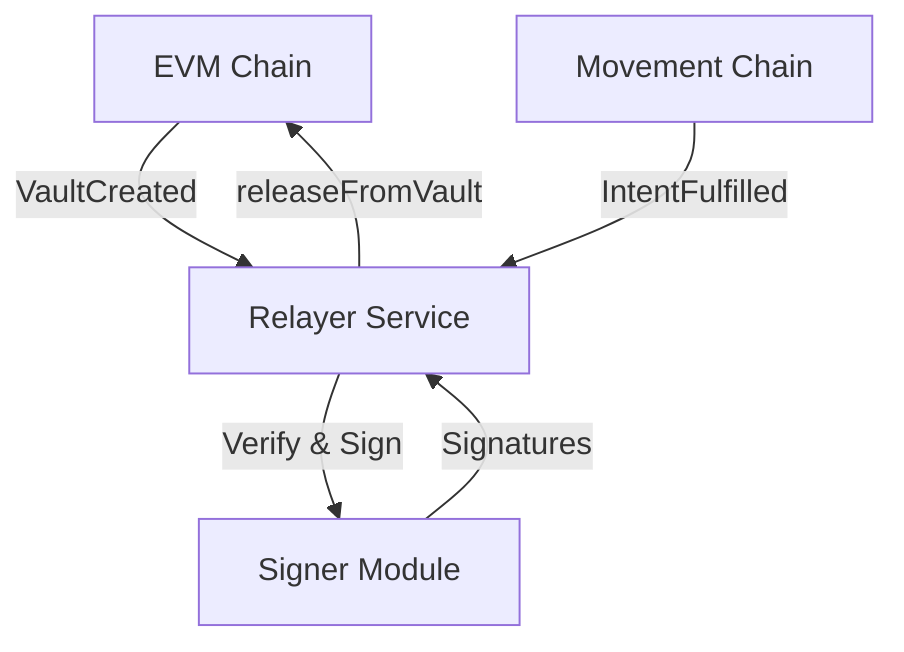

# Intent Protocol Relayer

The off-chain infrastructure responsible for witnessing cross-chain events and signing release authorizations.

## 🏗️ Architecture



## 🧩 Components

1.  **Watcher Service**: Monitors blockchain events.
    *   **EVM Watcher**: Listens for `VaultCreated` via Viem.
    *   **Movement Watcher**: Listens for `IntentFulfilled` via Aptos SDK.
2.  **Signer Service**: Manages relayer private keys and signs EIP-712 digests.
3.  **Executor**: Submits transactions to destination chains.

## 🔄 Workflow

### 1. Inbound (Movement → EVM)
*This flow is used when a Solver fulfills an intent on Movement and needs to unlock funds on EVM.*

1.  **Detect**: Watcher sees `IntentFulfilled(intent_id, recipient)` on Movement.
2.  **Verify**: Check that `Vault` exists on EVM for `intent_id`.
3.  **Sign**: Relayer signs `Release(intent_id, token, recipient, nonce)` typed data.
4.  **Execute**: Submit `releaseFromVault` txn to EVM `IntentVaultFactory` with collected signatures.

### 2. Outbound (EVM → Movement)
*This flow is used when a User locks funds on EVM to create an intent on Movement.*

1.  **Detect**: Watcher sees `VaultCreated(intent_id, amount)` on EVM.
2.  **Notify**: (Optional) Poke the Movement Intent Registry or Solvers that a new intent is funded.
3.  **Action**: Solvers see the fund lock and compete to fulfill on Movement.

## 🛠️ Technology Stack

*   **Runtime**: Node.js (TypeScript)
*   **EVM Client**: `viem` (Reliable, typed)
*   **Movement Client**: `@aptos-labs/ts-sdk` (Movement compatible)
*   **Storage**: `sqlite3` (Simple local state tracking) / `Redis` (Production)

## 📦 Service Structure

```
packages/relayer/
├── src/
│   ├── config/           # Chain configs, RPCs, Contract addresses
│   ├── services/
│   │   ├── EvmWatcher.ts
│   │   ├── MovementWatcher.ts
│   │   └── Signer.ts
│   ├── utils/
│   │   └── db.ts         # State persistence
│   └── index.ts          # Main entrypoint
├── .env                  # Keys (KEEP SECURE)
├── package.json
└── README.md
```

## 🚀 Setup

### Prerequisites
*   Node.js v18+
*   Relayer Private Key (Must be authorized in `IntentVaultFactory`)

### Installation

```bash
cd packages/relayer
npm install
```

### Configuration (env)

```bash
# Relayer Identity
RELAYER_PRIVATE_KEY=0x...

# EVM Configuration
EVM_RPC_URL=https://eth-sepolia.g.alchemy.com/v2/...
EVM_FACTORY_ADDRESS=0x...

# Movement Configuration
MOVEMENT_RPC_URL=https://aptos.testnet.porto.movementlabs.xyz/v1
MOVEMENT_REGISTRY_ADDRESS=0x...
```

### Run

```bash
npm run start
```
